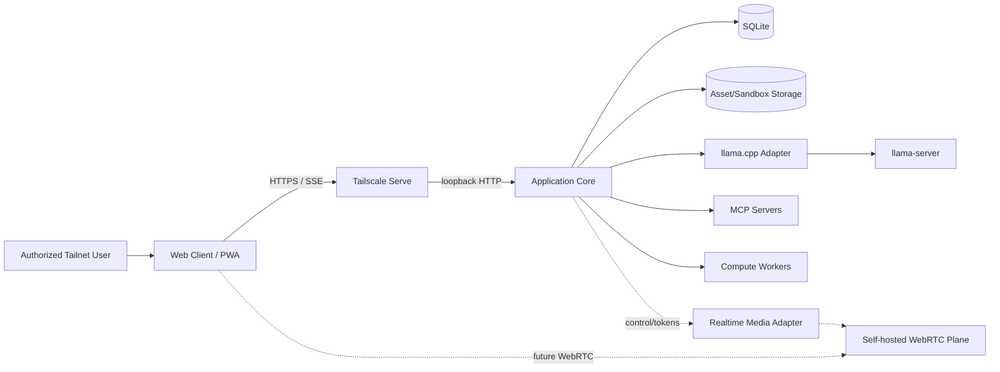
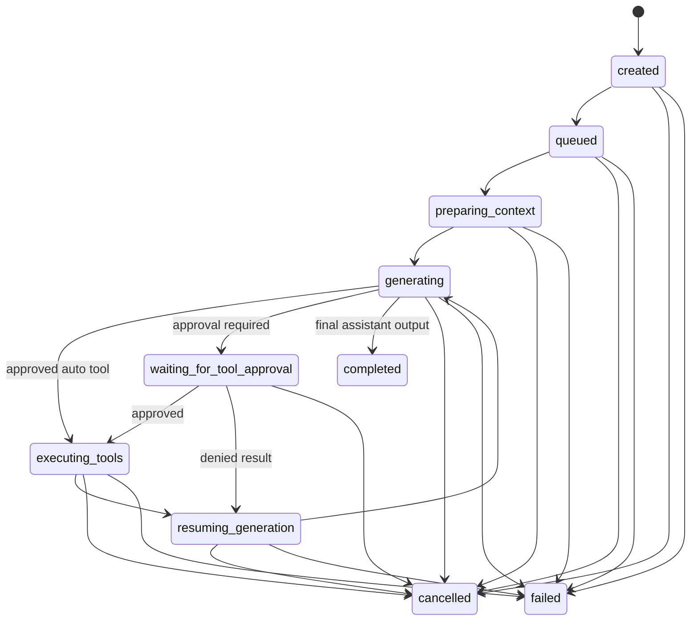

# Virtual Hypnotist — Software Design Document v0.03 — Expanded Convergence Edition

**Status:** Normative product architecture + convergence/migration design baseline + Codex execution manual  
**Version:** 0.03-expanded  
**Date:** 2026-09-15  
**Audience:** Mia in Codex / implementation agent / software engineer  
**Primary deployment:** Single local workstation, private Tailnet access via Tailscale  
**Primary inference backend:** `llama.cpp` / `llama-server`  
**Primary implementation chassis:** existing Unsloth Studio codebase  
**Reference codebases:** ErisHub and VoiceForge

---

## 0. Directive to future Mia in Codex

You are not building this product from an empty repository.

You will be given multiple existing codebases that contain overlapping infrastructure, experiments, UI work, and specialized subsystems. Treat them as **source material and evidence**, not as a set of applications that should be mechanically merged.

Your job is to construct one coherent product that satisfies this document while preserving useful, proven implementation work wherever doing so reduces risk, complexity, or development time.

The operating rule is:

> **Preserve working value. Remove accidental complexity. Reconstruct toward one architecture.**

Do not equate "new" with "better." Do not rewrite a working subsystem merely because the target architecture would have been designed differently from scratch. Likewise, do not preserve an implementation merely because it already exists.

For every meaningful subsystem, determine:

1. what behavior currently exists;
2. which repository owns the strongest implementation;
3. what dependencies and coupling that implementation carries;
4. whether its public behavior belongs in the target product;
5. whether the code itself should be preserved, refactored, adapted, or replaced;
6. what tests or observations prove the migration preserved the desired behavior.

The existing repositories MUST remain inspectable during convergence. They are the memory of earlier experiments. Do not destroy that memory before replacement behavior has been demonstrated.

---

## 1. Executive summary

Build a local-first, high-quality AI companion application centered on a persistent virtual hypnotist persona. The application is a rich browser client backed by a locally hosted application core and local AI/media workers. It is reachable privately over a configured Tailscale Tailnet and exposes an OpenAI-compatible API for external clients.

The final product MUST optimize for four properties, in this order:

1. **Interactive performance:** low time-to-first-token, smooth token streaming, responsive UI, minimal tool latency, fast media presentation, and a credible path to low-latency voice/video conversation.
2. **Modularity:** inference, agent orchestration, tools, MCP, storage, media, UI presentation, authentication, and realtime media remain separable through narrow contracts.
3. **Feature velocity:** new tools, views, model backends, presentation modes, and session modes should normally be added without changing unrelated subsystems.
4. **Premium UI quality:** the first-party client is a polished application, not merely an API test surface.

### 1.1 Convergence premise

Implementation is NOT greenfield.

The working repository will contain three source codebases:

- **Unsloth Studio** — primary implementation chassis. Its existing model lifecycle, llama.cpp orchestration, chat/inference infrastructure, OpenAI-compatible behavior, persistence, tooling, multimodal support, backend routing, and React frontend SHOULD be retained or adapted when they already satisfy the target requirements.
- **ErisHub** — feature/reference mine. It contains useful experiments and product behaviors, but its architecture is not the target architecture. Port useful behavior or narrowly reusable code; do not reproduce its accumulated coupling.
- **VoiceForge** — specialized bidirectional speech implementation. The current Unsloth fork already contains VoiceForge-backed ASR/speech recognition, chunked/incremental TTS/read-aloud, catalog discovery, voice/RVC selection, microphone/dictation controls, and connection plumbing. This existing integration is baseline infrastructure to preserve and adapt; it MUST NOT be reimplemented in parallel without a documented blocker.

The repository is physically unified for analysis and implementation convenience. Runtime architecture remains modular.

### 1.2 Revised application-core decision

The backend SHOULD be based on the existing **Python/FastAPI Unsloth Studio core**, not rewritten into Node/TypeScript merely to match an earlier greenfield preference.

Reasons:

- proven llama.cpp/model process management already exists;
- inference and crash-recovery logic already exists;
- OpenAI-compatible API behavior already exists;
- chat/history/tooling/multimodal infrastructure already exists;
- replacing working orchestration with another runtime would create risk without accelerating inference;
- performance-critical workloads already live in native processes or specialized workers.

React + TypeScript remains the frontend default.

The architectural center remains an **Application Core**. The browser never communicates directly with llama.cpp. The Application Core owns conversations, agent runs, tool policy, MCP, media/action routing, authentication, persistence, and public APIs. Inference engines are adapters beneath it.

Future voice/video calling MUST extend the same conversation, agent, tool, persona, and persistence core rather than creating a second application architecture.

---

## 2. Product vision

The product is a locally controlled AI environment centered on a persistent virtual hypnotist persona, with ordinary conversation, structured hypnotic sessions, visual presentation tools, multimodal understanding, local files, web search, configurable MCP tools, and eventually realtime voice/video interaction.

The system should feel closer to a native premium assistant application than to a generic web chat page.

A user should eventually be able to:

- open the application from any authorized Tailnet device;
- chat with a locally hosted model with token streaming;
- upload images and files naturally inside a conversation;
- let the model use configured MCP tools under explicit application policy;
- let the model display approved visual material such as spirals, images, videos, ambient backgrounds, timed overlays, or generated artifacts;
- transition an existing conversation into a voice or video call without creating a separate identity or losing context;
- interrupt spoken model output naturally;
- let the model see selected camera frames during a video call when enabled;
- use external software against an OpenAI-compatible local API;
- swap model profiles or inference backends without rewriting the product.

---

## 3. Design principles

### 3.1 Converge; do not mechanically merge

The three source repositories MUST NOT be overlaid into one undifferentiated source tree.

They live together so the implementation agent can inspect, compare, trace, test, and selectively migrate code. Production code lives separately.

### 3.2 Working behavior outranks aesthetic rewrites

A subsystem that is reliable, understandable, testable, and compatible with the target boundaries SHOULD be preserved even if a greenfield implementation might look cleaner.

A rewrite requires a concrete reason such as:

- incompatible responsibility boundaries;
- duplicated ownership;
- security weakness;
- inability to cancel or supervise correctly;
- unacceptable performance;
- severe coupling that blocks planned features;
- untestable global state;
- obsolete dependency/runtime constraints;
- behavior that directly conflicts with the product specification.

"I would design it differently" is not sufficient justification.

### 3.3 Port behavior before architecture

When ErisHub contains a useful feature but an unsuitable implementation, preserve the feature semantics and UX lessons while implementing them through the target contracts.

Examples include call-mode behavior, hypnosis presentation, background media, tool permissions, environmental context, memory/session summaries, and avatar/media integrations.

### 3.4 One-way migration

Production code MAY be copied or adapted from a source repository with provenance recorded.

Production code MUST NOT import source code from `legacy/` at runtime.

The dependency direction is always:

```text
legacy/*  ----inspection/copy/adaptation---->  app/* / services/*

app/*     --------------------X------------->  legacy/*
```

A test/lint rule SHOULD enforce this invariant.

### 3.5 Legacy trees are read-only evidence

During convergence, `legacy/unsloth`, `legacy/erishub`, and `legacy/voiceforge` MUST be treated as read-only snapshots unless an explicit task says otherwise.

Do not "clean up" source trees in place. Do not delete them because a migration appears complete. Keep them available until the replacement has passed its acceptance tests and the project owner deliberately retires them.

### 3.6 Local-first, network-private

The default deployment is one trusted local machine. Remote access is through Tailscale rather than direct public internet exposure.

Application services SHOULD bind to loopback unless a service specifically requires direct Tailnet media connectivity.

### 3.7 Fast path stays short

The common text-chat path MUST remain short:

```text
Browser -> Application Core -> llama-server -> Application Core -> Browser
```

No message broker, remote database, container hop, or general-purpose RPC mesh belongs in the default token-streaming path.

### 3.8 Modular monolith before microservices

Most application modules SHOULD run in the existing FastAPI application process with explicit internal boundaries. A capability becomes a sidecar/process only when isolation is materially useful, for example:

- GPU/CPU-intensive inference;
- speech synthesis/recognition;
- media transcoding;
- native runtime isolation;
- realtime media infrastructure;
- externally supplied MCP servers;
- components with independent crash/restart behavior.

### 3.9 Model backend is replaceable

Nothing above the inference adapter may rely on llama.cpp-specific behavior without going through a capability abstraction.

Existing Unsloth llama.cpp code MAY initially implement that abstraction rather than being rewritten first.

### 3.10 Browser presentation is typed, never generated code

The model may request declared UI actions. It MUST NOT generate executable HTML, JavaScript, CSS, React components, or arbitrary DOM operations for execution.

### 3.11 Realtime media is a separate plane

- Text chat: HTTP + SSE by default.
- Bidirectional control: HTTP plus optional WebSocket/session channel.
- Audio/video calls: WebRTC media plane.

Do not stream microphone or camera media through ordinary application WebSockets.

### 3.12 One domain model, many interaction modes

Chat mode, hypnosis session mode, voice call mode, and video call mode share the same core concepts: principal, conversation, message, run, persona, tools, session, attachments, and assets.

A call is a richer active session over a conversation, not a parallel conversation engine.

### 3.13 Configuration over forks

Personas, model profiles, tool policy, MCP servers, UI-tool defaults, call behavior, and media settings SHOULD be configuration/data rather than product forks.

---

## 4. High-level architecture

```text
                              AUTHORIZED TAILNET DEVICE

                         +-------------------------------+
                         | Browser / PWA / optional Tauri|
                         | React + TypeScript            |
                         | Chat / MediaStage / Calls     |
                         +---------------+---------------+
                                         |
                              HTTPS/SSE  |  future WebRTC
                                         |
                              +----------v----------+
                              | Tailscale / TLS edge|
                              +----------+----------+
                                         |
                               loopback application HTTP
                                         |
                 +-----------------------v-----------------------+
                 |              APPLICATION CORE               |
                 |          Python / FastAPI modular core       |
                 |                                             |
                 | existing Unsloth infrastructure             |
                 | + converged domain/session/tool boundaries  |
                 |                                             |
                 | API / Auth / Conversation / Agent / MCP     |
                 | Assets / Sandbox / Presentation / Realtime  |
                 +------+----------------+----------------+-----+
                        |                |                |
                 inference API       MCP JSON-RPC       media/speech
                        |                |                |
                  +-----v-----+    +-----v------+   +-----v----------+
                  | llama.cpp |    | MCP servers |   | workers/services|
                  | server(s) |    | stdio/HTTP  |   | VoiceForge etc. |
                  +-----------+    +------------+   +----------------+
```

The physical monorepo may contain all source code. That does not imply all source code belongs in one process.

---

## 5. Technology and repository strategy

### 5.1 Backend

Use the existing Unsloth Studio Python/FastAPI backend as the primary chassis.

Prefer:

- Python version already supported by the retained Unsloth code unless a migration requires an upgrade;
- FastAPI for HTTP/API composition;
- Pydantic/JSON Schema for request/event validation;
- SQLite where existing persistence is compatible with product needs;
- explicit services/modules rather than growing route files into composition roots;
- `asyncio` only for orchestration/I/O; CPU-heavy work belongs in native/worker processes.

Do NOT rewrite mature backend behavior into Node merely for uniform frontend/backend language.

### 5.2 Frontend

Retain/adapt the existing Unsloth Studio React + TypeScript frontend where useful.

Preferred target properties remain:

- React + TypeScript;
- Vite;
- TanStack routing/query where already useful;
- lightweight client state such as Zustand;
- accessible Radix/shadcn-style primitives;
- virtualized long conversations;
- strict Markdown sanitization;
- purposeful animation;
- responsive/PWA-friendly design;
- optional Tauri packaging may remain supported if it does not distort the web architecture.

Large existing components MUST be decomposed progressively when their ownership blocks feature work. Do not rewrite them wholesale solely because they are large.

### 5.3 Heavy/compute components

Use isolated native/specialized components for:

- LLM/VLM inference: llama.cpp;
- audio/video transcoding: FFmpeg;
- image transforms/thumbnails: existing proven library or libvips-equivalent;
- speech recognition / STT: preserve and normalize the existing configurable Unsloth↔VoiceForge path behind the shared speech boundary;
- speech synthesis / TTS: preserve and normalize the existing chunked/incremental Unsloth↔VoiceForge path behind the same shared speech boundary;
- WebRTC media: provider abstraction, with self-hosted LiveKit as a candidate adapter when call mode is implemented.

### 5.4 Unified workspace layout

The convergence workspace SHOULD begin as:

```text
virtual-hypnotist/
  DESIGN.md                         # this document or canonical copy

  app/                              # production application only
    backend/                        # seeded from/adapted from Unsloth Studio backend
    frontend/                       # seeded from/adapted from Unsloth Studio frontend

  services/                         # production sidecars kept in same repository
    voiceforge/                     # only after consciously promoting/adapting it
    media/                          # optional isolated jobs
    realtime/                       # future WebRTC integration

  legacy/                           # READ-ONLY SOURCE MATERIAL
    unsloth/                        # complete source snapshot
    erishub/                        # complete source snapshot
    voiceforge/                     # complete source snapshot

  migration/
    inventory.md                    # capability and ownership inventory
    feature-matrix.md               # old behavior -> target behavior tracking
    decisions.md                    # KEEP/PORT/etc. decisions + rationale
    provenance.md                   # copied/adapted source provenance
    gaps.md                         # requirements not yet satisfied
    rejected.md                     # deliberately discarded behaviors/implementations

  docs/
    adr/

  tests/
    contract/
    integration/
    e2e/
    performance/

  licenses/                         # consolidated license/notice material as needed
  scripts/
  data/                             # runtime, gitignored
```

The actual retained Unsloth layout MAY be preserved within `app/` when changing it would create pointless churn. Folder aesthetics are subordinate to dependency clarity.

### 5.5 Seed strategy

Do not begin with an empty `app/` if the Unsloth Studio application already provides the majority of the required runtime.

Recommended procedure:

1. place intact repository snapshots under `legacy/`;
2. record exact source commit/revision and license information;
3. copy the selected Unsloth Studio application subtree into `app/` as the initial production chassis;
4. establish a known-good baseline by building/running its existing frontend/backend and relevant tests;
5. only then begin structural convergence;
6. move/copy ErisHub or VoiceForge behavior into production locations only through explicit migration tasks.

### 5.6 Production dependency rule

No production Python/TypeScript/CSS/build configuration may resolve imports from `legacy/**`.

This prohibition applies to runtime, development, and test code for the final product, except migration-analysis scripts explicitly scoped under `migration/` or `scripts/migration/`.

### 5.7 Repository-source classifications

Every meaningful candidate subsystem MUST be classified before destructive migration:

- **KEEP** — implementation already fits the target sufficiently; retain with minimal change.
- **KEEP + REFACTOR** — behavior and most code are valuable; improve boundaries incrementally.
- **PORT CODE** — a narrow implementation can be copied/adapted cleanly into the target.
- **PORT BEHAVIOR** — desired behavior is valuable, but implementation architecture should not be carried forward.
- **REIMPLEMENT** — requirement exists but source implementations are unsuitable.
- **DELETE** — production behavior/code should not survive convergence.
- **DEFER** — useful candidate but not required for the current milestone.

For each classification, `migration/decisions.md` SHOULD record source location, target location, rationale, risks, and acceptance evidence.

### 5.8 What counts as "good" code for reuse

Prefer preservation when code:

- already works in realistic use;
- has clear responsibility;
- has manageable dependencies;
- can be tested in isolation or through stable interfaces;
- handles cancellation/recovery appropriately;
- does not bypass security/tool policy;
- does not duplicate another subsystem's authority;
- fits or can cheaply fit the target architecture;
- reduces implementation risk or time.

Do not preserve code solely because it is sophisticated, large, or feature-rich.

### 5.9 What counts as "bad" code for removal/refactor

Candidates include:

- duplicate llama.cpp/model managers;
- duplicate conversation authorities;
- god routes/components that own unrelated domains;
- unbounded global mutable state;
- direct frontend-to-inference coupling;
- feature modules that mutate unrelated UI/runtime state through hidden hooks;
- duplicated tool-policy logic;
- uncancellable long-running work;
- unsafe host-file access;
- arbitrary model-generated browser execution;
- architecture that would require every future feature to modify a central switchboard.

"Large file" alone is not a deletion criterion. First understand why it is large and which responsibilities can be extracted safely.

### 5.10 No mass deduplication pass

Do NOT run automated broad deduplication or cross-repository merge operations before subsystem ownership is understood.

Forbidden as an initial strategy:

- overlaying directories by filename;
- auto-merging same-named classes/modules;
- deleting "duplicate" code based only on text similarity;
- dependency upgrades unrelated to the subsystem being migrated;
- sweeping formatter/renamer changes across all three source trees;
- replacing the existing application framework for aesthetic consistency.

Convergence is subsystem-by-subsystem and behavior-driven.

### 5.11 Provenance and licensing

Preserve original license files, notices, copyright headers, and commit provenance.

When source code is copied or materially adapted into production code, record enough information in `migration/provenance.md` to identify:

- source repository;
- source revision;
- original file/path;
- target file/path;
- whether copied, adapted, or behavior-only;
- relevant license/notice obligations.

Do not let automated cleanup remove attribution or license material.

---

## 6. Application Core modules

### 6.1 Conversation Service

Responsibilities:

- Create/archive/delete conversations.
- Add and retrieve messages.
- Associate attachments.
- Track persona/model profile selections.
- Provide timeline queries.
- Maintain mode-independent conversation state.

It MUST NOT execute models or tools.

### 6.2 Run Coordinator

Represents one model-turn execution.

Responsibilities:

- Serialize or intentionally parallelize runs per conversation.
- Create cancellation tokens.
- Emit run events.
- Persist run lifecycle.
- Coordinate the Agent Runtime.
- Ensure cancellation propagates to inference/tools/media.

### 6.3 Agent Runtime

A backend-neutral state machine.

Conceptual states:

```text
created
  -> assembling_context
  -> inferring
  -> awaiting_tool_approval
  -> executing_tools
  -> inferring
  -> completed

Any active state -> cancelling -> cancelled
Any active state -> failed
```

The Agent Runtime consumes:

- assembled model-visible messages
- inference backend
- exposed tool descriptions
- tool executor
- policy decisions
- cancellation signal

It emits typed semantic events rather than HTTP-specific SSE strings.

### 6.4 Context Engine

Own context-window management separately from conversations.

Responsibilities:

- System/persona prompt assembly.
- Message selection.
- Tool-result inclusion.
- Image/media input selection.
- Token-budget estimation.
- Context trimming.
- Optional conversation summarization.
- Optional memory injection later.

The database history MUST remain lossless even when the model-visible context is truncated or summarized.

### 6.5 Tool Registry

Every model-callable capability is normalized into one contract regardless of origin.

```ts
interface ToolDefinition {
  id: string;
  displayName: string;
  description: string;
  inputSchema: JSONSchema;
  source: "builtin" | "mcp" | "client";
  riskClass: ToolRiskClass;
  capabilities: string[];
  timeoutMs: number;
}
```

Execution is separated from description.

### 6.6 Tool Policy Engine

Determines whether a tool may execute and whether approval is required.

Policy input SHOULD include:

- principal
- conversation
- session type
- tool ID/source/server
- tool arguments
- requested capabilities
- saved permission grants
- active session opt-ins

### 6.7 MCP Manager

Owns MCP server lifecycle independently of the Agent Runtime.

Responsibilities:

- Start/stop stdio MCP processes.
- Connect/disconnect Streamable HTTP servers.
- Perform protocol initialization/capability negotiation.
- Cache tool/resource metadata appropriately.
- Map MCP tools into Tool Registry entries.
- Enforce timeouts.
- Collect stderr/logs separately from protocol stdout.
- Restart unhealthy local servers according to policy.
- Redact secrets from logs.

Support standard MCP transports:

- `stdio`
- Streamable HTTP

Legacy HTTP+SSE MAY be supported behind an adapter if useful, but MUST NOT shape the internal API.

### 6.8 Asset Service

Owns all uploaded/generated media.

Responsibilities:

- Asset IDs.
- MIME detection.
- metadata.
- authenticated streaming.
- thumbnails/derivatives.
- model-input transformations.
- retention/lifecycle.

### 6.9 Realtime Session Coordinator

Initially contains only contracts and state management. Call-mode implementation later attaches a media-plane adapter.

Responsibilities:

- Create/end realtime sessions associated with a conversation.
- Track modalities enabled by the user.
- Manage turn/interruption state.
- Correlate transcripts and model runs.
- Route STT/TTS/VAD events.
- Route sampled visual observations into the context engine.

---

## 7. Inference abstraction

The Application Core MUST use an inference-neutral interface.

Suggested high-level contract:

```ts
interface InferenceBackend {
  getCapabilities(): Promise<InferenceCapabilities>;
  listModels(): Promise<ModelDescriptor[]>;
  streamChat(request: ChatRequest, signal: AbortSignal): AsyncIterable<InferenceEvent>;
  health(): Promise<BackendHealth>;
}
```

Capability object SHOULD represent:

```ts
interface InferenceCapabilities {
  chat: boolean;
  streaming: boolean;
  toolCalls: boolean;
  jsonSchema: boolean;
  vision: boolean;
  audioInput: boolean;
  videoInput: boolean;
  maxContextTokens?: number;
  backendExtensions: string[];
}
```

Backend-specific options MAY be exposed through an `extensions` object but MUST NOT leak into domain entities.

---

## 8. llama.cpp integration and performance strategy

### 8.1 Process model

Run `llama-server` as a long-lived process. Avoid launching inference per request.

The application SHOULD support two management modes:

```yaml
inference:
  process_mode: supervised   # supervised | external
```

- `supervised`: application launches/restarts configured llama-server profiles.
- `external`: application connects to an already-running compatible endpoint.

The initial implementation SHOULD support external mode first and supervised mode soon after.

### 8.2 Default binding

```text
127.0.0.1:8080
```

Do not expose llama.cpp directly to the Tailnet by default.

### 8.3 Startup/warmup

The inference manager SHOULD:

- Start/load the configured model before the first user turn when possible.
- Wait for health readiness.
- Perform a small warmup if the backend does not already do so.
- Surface model loading state to the UI.

### 8.4 Prompt/context reuse

The adapter SHOULD take advantage of supported llama.cpp prompt/KV cache reuse for conversations with stable prefixes.

Requirements:

- Stable persona/system prompts SHOULD remain byte/token stable where possible.
- Avoid injecting volatile timestamps or reordered tool descriptions into the beginning of every prompt unless required.
- Tool definitions SHOULD be deterministically ordered.
- Context assembly SHOULD maximize reusable prefix length.
- Backend-specific cache controls such as prompt caching MAY be enabled through the adapter.

Do not make correctness depend on a specific cache hit.

### 8.5 Continuous batching and parallel slots

llama.cpp supports parallel slots and continuous batching. Configuration SHOULD expose them, but defaults MUST be tuned for interactive latency rather than aggregate benchmark throughput.

For a typical personal deployment:

- Begin with one primary interactive slot.
- Add a second slot only when concurrent jobs justify its KV-memory cost.
- Background summarization/embedding workloads SHOULD NOT silently steal the only latency-critical generation slot.

The status UI SHOULD report active/queued inference work.

### 8.6 Flash attention / GPU offload

The generated launch profile SHOULD expose supported acceleration options rather than hard-code one machine's values.

Example:

```yaml
models:
  main:
    backend: llamacpp
    model: /models/main.gguf
    mmproj: /models/main-mmproj.gguf
    context_tokens: 32768
    parallel_slots: 1
    flash_attention: auto
    gpu_layers: auto
    batch_size: auto
    ubatch_size: auto
    prompt_cache: true
```

An optional hardware tuner MAY later benchmark safe profile presets.

### 8.7 Speculative decoding

Speculative decoding SHOULD be an optional model-profile feature, not an architectural dependency.

If enabled:

- target/draft model compatibility MUST be validated
- acceptance-rate and throughput metrics SHOULD be visible
- failure falls back to ordinary decoding

### 8.8 Generation latency metrics

Capture at minimum:

- queue time
- prompt-evaluation time
- time to first token
- generation tokens/sec
- total generation duration
- prompt tokens
- output tokens
- cache reuse information when exposed

The UI SHOULD expose a compact diagnostics panel for these values.

### 8.9 Multimodal media input

Current llama.cpp multimodal support can accept image/audio/video for supported models. The app MUST still mediate and normalize media.

The model adapter MUST NOT receive arbitrary full-resolution assets by default.

Before inference:

- strip unnecessary metadata where appropriate
- constrain resolution
- create optimized derivatives
- bound number of images/frames
- enforce model/profile-specific media limits

---

## 9. Performance budgets

These are engineering targets, not guaranteed hardware-independent SLAs.

### 9.1 UI

On a modern desktop browser with warm assets:

- Input-to-local-message render: target < 16 ms.
- Main UI interactions should normally remain under one animation frame.
- Long conversations must remain smooth through list virtualization.
- Token stream rendering SHOULD be batched to animation frames rather than trigger a React render for every token/chunk.
- Opening tool/activity panels SHOULD NOT block token rendering.

### 9.2 Backend

Excluding model execution and external tools:

- Local API routing/validation overhead target: < 10 ms typical.
- Browser UI action dispatch target: < 50 ms typical on LAN/Tailnet.
- SQLite message persistence SHOULD be off the token-forwarding critical path where safe while preserving ordering/durability.

### 9.3 Chat inference

Primary optimization goal is perceived latency:

1. minimize queueing
2. minimize prompt prefill
3. emit first meaningful token quickly
4. maintain smooth decode cadence

Do not trade a large increase in TTFT for a small aggregate throughput win in the default interactive profile.

### 9.4 Future voice mode

Initial target budgets:

- end-of-user-speech detection: configurable, target roughly 200–500 ms after actual stop depending on VAD policy
- STT finalization: target < 500 ms for local streaming engine where hardware permits
- LLM first semantic output: target < 700 ms after transcript finalization on suitable hardware
- TTS first playable audio: target < 300 ms after receiving a speakable chunk

The architecture SHOULD allow partial STT and incremental TTS to overlap with model generation.

---

## 10. Frontend architecture

### 10.1 App shell

Desktop default layout:

```text
+-------------------------------------------------------------------+
| top bar / conversation / model / connection / session status      |
+-------------+--------------------------------------+--------------+
|             |                                      |              |
| conversation|           MAIN WORKSPACE             | activity /   |
| sidebar     |                                      | tools panel  |
|             | chat + media stage                   | optional     |
|             |                                      |              |
+-------------+--------------------------------------+--------------+
| composer / attachments / mode / microphone controls               |
+-------------------------------------------------------------------+
```

Panels MUST be collapsible and layout SHOULD adapt to tablet/mobile.

### 10.2 Feature modules

Frontend code SHOULD be organized by feature rather than component type alone.

```text
features/
  conversations/
  chat/
  composer/
  attachments/
  media-stage/
  tool-activity/
  sessions/
  call/
  models/
  mcp/
  settings/
  diagnostics/
```

Shared primitives belong in `components/ui`.

### 10.3 Chat timeline

The message timeline MUST support:

- streaming assistant text
- Markdown
- code blocks
- image/file cards
- tool-call cards
- expandable tool results
- edits/regeneration later
- model/latency metadata on demand
- inline system status events without pretending they are chat messages

System/application events MUST remain distinct from model-visible messages.

### 10.4 Streaming render strategy

Do not update global React state on every token.

Recommended pattern:

1. SSE parser appends deltas to a lightweight run buffer.
2. UI flushes buffer at most once per animation frame.
3. Completed message is committed to normal query/cache state.

This prevents token-rate-dependent component-tree churn.

### 10.5 Media Stage

Create a reusable `MediaStage` from the beginning rather than special-casing spiral overlays.

Supported presentation layers MAY include:

```text
background
ambient
content
foreground
modal-overlay
```

Each active presentation is a typed item:

```ts
interface PresentationItem {
  id: string;
  kind: "spiral" | "image" | "video" | "ambient" | "visualizer";
  layer: PresentationLayer;
  owner: "user" | "model" | "system";
  dismissible: boolean;
  startedAt: number;
  expiresAt?: number;
  payload: unknown;
}
```

The Stage handles composition, transitions, aspect ratio, playback state, and clearing.

### 10.6 Spiral rendering

The spiral SHOULD be rendered locally using Canvas/WebGL/CSS/SVG with a typed parameter set. It MUST NOT be video streamed from the backend unless a future specialized effect requires it.

Potential parameters:

- rotational speed
- direction
- radial density
- center position
- scale
- contrast
- opacity
- easing/ramp
- duration
- layer/presentation mode

Animation MUST use browser animation timing and avoid React state updates per frame.

### 10.7 Design system

Establish design tokens early:

- color roles
- surfaces
- typography
- spacing
- radii
- elevation
- motion duration/easing
- focus states
- media-stage transitions

Dark mode SHOULD be first-class rather than an afterthought.

The application MAY have a distinctive gothic/immersive visual identity, but content legibility and control discoverability outrank ornamentation.

### 10.8 Command palette

A global command palette SHOULD eventually expose:

- new conversation
- switch conversation
- toggle session mode
- switch model/persona
- open MCP settings
- clear media
- stop run/session
- diagnostics

### 10.9 Responsive/mobile design

Mobile MUST not be a shrunk desktop layout.

- Sidebar becomes drawer.
- Tool activity becomes bottom sheet/drawer.
- Media stage can become primary viewport.
- Composer respects mobile keyboard/safe-area insets.
- Session stop control remains persistent.

### 10.10 PWA

PWA installation MAY be supported later. The app SHOULD avoid architectural assumptions that prevent it.

Offline inference is not meaningful from a remote Tailnet device, but cached UI shell and graceful disconnected-state handling are useful.

---

## 11. Client/server event protocol

All first-party run/session events MUST be versioned typed objects.

Example envelope:

```ts
interface AppEvent<T = unknown> {
  version: 1;
  id: string;
  type: string;
  timestamp: string;
  conversationId?: string;
  runId?: string;
  sessionId?: string;
  payload: T;
}
```

### 11.1 Text run transport

Use SSE for model/run events initially.

Representative events:

```text
run.started
run.queue.updated
assistant.message.started
assistant.text.delta
assistant.message.completed

tool.requested
tool.approval.required
tool.started
tool.progress
tool.completed
tool.failed

presentation.requested
presentation.started
presentation.updated
presentation.completed
presentation.failed

run.completed
run.cancelled
run.failed
```

### 11.2 Bidirectional session control

HTTP POST endpoints are sufficient initially for approvals, acknowledgements, and cancellation.

Introduce a WebSocket control channel when continuous session events make it materially simpler, especially for call/realtime status. Do not replace SSE merely for architectural fashion.

### 11.3 Event durability

Semantic run/tool events SHOULD be persisted where useful for diagnostics, but raw token deltas need not be individually stored.

The completed assistant message is the canonical persisted text.

---

## 12. Native API

Version first-party APIs under `/api/v1`.

Suggested surface:

```text
GET    /api/v1/health
GET    /api/v1/me
GET    /api/v1/capabilities

GET    /api/v1/conversations
POST   /api/v1/conversations
GET    /api/v1/conversations/:id
PATCH  /api/v1/conversations/:id
DELETE /api/v1/conversations/:id

GET    /api/v1/conversations/:id/messages
POST   /api/v1/conversations/:id/messages

POST   /api/v1/conversations/:id/runs
GET    /api/v1/runs/:id/events
POST   /api/v1/runs/:id/cancel

POST   /api/v1/assets
GET    /api/v1/assets/:id
GET    /api/v1/assets/:id/content
GET    /api/v1/assets/:id/thumbnail

GET    /api/v1/tools
POST   /api/v1/tool-invocations/:id/approve
POST   /api/v1/tool-invocations/:id/deny
POST   /api/v1/tool-invocations/:id/result

GET    /api/v1/mcp/servers
POST   /api/v1/mcp/servers
PATCH  /api/v1/mcp/servers/:id
POST   /api/v1/mcp/servers/:id/test
POST   /api/v1/mcp/servers/:id/restart

GET    /api/v1/models
GET    /api/v1/inference/status
POST   /api/v1/models/:id/activate

POST   /api/v1/sessions
GET    /api/v1/sessions/:id
POST   /api/v1/sessions/:id/stop
```

Call-mode endpoints are added under `/api/v1/realtime/...` without changing ordinary run APIs.

---

## 13. OpenAI-compatible API

Provide a separate compatibility boundary under `/v1`.

Required:

```text
GET  /v1/models
POST /v1/chat/completions
```

Strongly recommended when compatible with the selected backend abstraction:

```text
POST /v1/responses
POST /v1/embeddings   # only if an embeddings backend/profile exists
```

Compatibility rules:

- Authenticate with application bearer API keys.
- Preserve normal caller-managed tool semantics by default.
- Do not silently execute first-party managed tools for generic clients.
- Do not expose Tailscale identity headers as API auth.
- Use explicit extensions if a trusted client wants application-managed tools.

The compatibility gateway is an adapter to Application Core/inference services, not a reverse proxy that accidentally exposes all raw llama.cpp endpoints.

---

## 14. Tool architecture

### 14.1 Tool sources

Normalize three tool sources:

1. built-in server tools
2. MCP tools
3. browser/client-mediated tools

All enter the same Tool Registry and Tool Policy Engine.

### 14.2 Built-in tools

Initial built-ins:

```text
files.list
files.stat
files.read
files.write
files.delete          # approval required by default
assets.inspect
assets.list
```

Web search SHOULD preferably be an MCP integration rather than deeply hard-coded unless a bundled provider is desired.

### 14.3 Browser-mediated presentation tools

Initial namespace:

```text
ui.spiral.show
ui.image.show
ui.video.play
ui.media.clear
ui.ambient.set
```

Future:

```text
ui.focus.set
ui.text.show
ui.visualizer.show
ui.scene.apply
```

Each tool returns a structured result with presentation ID and status.

### 14.4 No arbitrary browser execution

Tool schemas MUST constrain values. The browser revalidates all payloads before execution.

Never accept:

- arbitrary HTML
- arbitrary JS
- arbitrary CSS
- arbitrary iframe URL by default
- arbitrary local path

### 14.5 Tool execution concurrency

Independent read-only tools MAY execute in parallel up to a configured limit.

Actions affecting the same presentation stage or mutable file SHOULD be serialized or explicitly conflict-resolved.

### 14.6 Tool cancellation

Executors SHOULD accept `AbortSignal` or an equivalent cancellation primitive.

On run/session cancellation:

- stop cancellable tools
- ignore/detach late results from non-cancellable tools
- never resume a cancelled model run because a tool finished later

---

## 15. MCP configuration and lifecycle

Example:

```yaml
mcp:
  servers:
    web_search:
      enabled: true
      transport: stdio
      command: npx
      args: ["-y", "example-search-mcp"]
      env:
        SEARCH_API_KEY: "${SEARCH_API_KEY}"
      startup_timeout_ms: 10000
      call_timeout_ms: 30000
      restart_policy: on_failure
      tools:
        allow: ["search", "fetch"]
      approval: safe_read

    remote_tools:
      enabled: false
      transport: streamable_http
      url: "https://example.internal/mcp"
      auth_secret_ref: "remote_tools_token"
      approval: ask
```

Requirements:

- MCP configs are validated before activation.
- stdio stdout is protocol-only; stderr is captured separately.
- HTTP MCP uses origin/auth protections appropriate to current MCP specification.
- Model never receives MCP credentials.
- MCP tool descriptions are untrusted metadata, not security policy.
- Tool list changes update the registry without restarting the entire application when practical.

### 15.1 Hot reload

MCP server definitions SHOULD support controlled hot reload:

- add server
- disable server
- restart server
- refresh advertised tools

Active calls may finish under the configuration snapshot with which they started.

---

## 16. File sandbox and assets

### 16.1 Storage layout

```text
data/
  app.sqlite3
  assets/
    <principal-id>/
      <asset-id>/
        original
        metadata.json       # optional cache, DB remains authoritative
        derivatives/
  sandboxes/
    <principal-id>/
      shared/
      conversations/
        <conversation-id>/
      sessions/
        <session-id>/
```

### 16.2 Sandbox abstraction

Tools MUST use a sandbox service, not raw `fs` calls scattered across tool implementations.

Interface example:

```ts
interface Sandbox {
  list(path: LogicalPath): Promise<Entry[]>;
  read(path: LogicalPath, options?: ReadOptions): Promise<Buffer>;
  write(path: LogicalPath, data: Buffer): Promise<void>;
  delete(path: LogicalPath): Promise<void>;
  resolveAsset(path: LogicalPath): Promise<AssetRef | null>;
}
```

### 16.3 Required protections

- canonical path resolution
- traversal rejection
- symlink escape prevention
- bounded read/write/upload sizes
- MIME sniffing
- safe logical names
- no executable permission inheritance
- no raw host paths shown to model

### 16.4 Upload performance

Uploads SHOULD stream to disk instead of buffering full files in memory.

Image thumbnail/derivative generation SHOULD run outside the main event loop.

Large video SHOULD not be eagerly transcoded unless needed.

---

## 17. Persistence

Use SQLite with WAL enabled.

Recommended entities:

```text
principals
api_keys
conversations
messages
message_parts
assets
asset_derivatives
runs
run_events
tool_invocations
tool_permissions
mcp_servers
model_profiles
persona_profiles
sessions
session_events
summaries
```

### 17.1 Message parts

Represent message content as typed parts rather than one nullable text blob.

```ts
type MessagePart =
  | { type: "text"; text: string }
  | { type: "image"; assetId: string }
  | { type: "file"; assetId: string }
  | { type: "tool_call"; invocationId: string }
  | { type: "tool_result"; invocationId: string };
```

This maps cleanly to modern multimodal model APIs.

### 17.2 Database concurrency

Use a small intentional connection model suitable for SQLite rather than a large generic pool.

Writes SHOULD be short transactions.

Long-running inference/tool operations MUST NOT hold database transactions open.

### 17.3 Schema migrations

Every schema change MUST have a checked-in migration. Startup MAY auto-apply compatible local migrations after making a backup or ensuring recoverability.

---

## 18. Authentication, Tailscale, and network topology

### 18.1 Text/UI deployment

Default:

```text
Browser on Tailnet
  -> Tailscale Serve HTTPS
  -> 127.0.0.1:<app-port>
```

The app server SHOULD bind only to loopback.

When using Tailscale Serve identity headers, trust them only from the loopback reverse-proxy path.

### 18.2 Principal mapping

Map Tailscale login identity to an application principal. Do not use display name alone as a stable identity key.

Application authorization remains separate from network membership.

### 18.3 API clients

OpenAI-compatible clients use application-issued bearer keys.

Keys MUST be:

- revocable
- scoped where useful
- stored hashed when possible
- omitted from logs

### 18.4 Future realtime media networking

Tailscale Serve remains appropriate for the web application and HTTPS/WebSocket signaling. It does not replace WebRTC's media transport.

For self-hosted LiveKit on a Tailnet, the deployment SHOULD prefer a small explicit media port surface, for example LiveKit's single UDP mux option when suitable, plus TCP fallback if required. Tailnet policy SHOULD limit access to those ports.

The exact LiveKit/Tailscale topology MUST be tested on the target host and client platforms before call mode is considered complete.

Do not publicly expose call infrastructure merely to make private Tailnet calls easier.

---

## 19. Hypnosis/session model

### 19.1 Session types

```ts
type SessionType = "chat" | "hypnosis" | "voice_call" | "video_call";
```

Ordinary chat does not require an active session row unless useful for analytics/state. Hypnosis and call modes do.

### 19.2 Session capabilities

Example:

```json
{
  "type": "hypnosis",
  "active": true,
  "permissions": {
    "modelVisuals": true,
    "modelVideo": true,
    "modelAudio": false,
    "cameraVision": false,
    "microphone": false
  }
}
```

### 19.3 Hard stop semantics

The UI MUST expose an always-available `Stop Session` action during any active hypnosis/call presentation.

It performs atomically from the user's perspective:

1. mark session stopping
2. abort active model run
3. stop/detach TTS
4. reject pending presentation actions
5. clear model-controlled media
6. stop model-started audio/video playback
7. disable camera/microphone tracks when appropriate
8. mark session inactive
9. return UI to ordinary conversation state

The model cannot hide, rename beyond recognition, intercept, or disable this control.

---

## 20. Future voice call architecture

Voice calling is a planned feature, but the speech substrate is **not greenfield**. The current Unsloth fork already includes VoiceForge-backed ASR/speech recognition and chunked/incremental TTS/read-aloud support. Voice call work MUST begin by tracing, testing, and reusing that existing bidirectional speech path.

The call feature is therefore primarily an orchestration problem: realtime turn detection, interruption, cancellation, buffering, state coordination, transcript synchronization, and later WebRTC transport. It is NOT permission to construct a second STT/TTS stack beside the one already present.

Before implementing any call-mode speech code, future Mia MUST document the current Unsloth↔VoiceForge paths for capture, ASR, text chunking, synthesis, audio transport, playback, cancellation, catalog discovery, and settings ownership in `migration/01-unsloth-fork-delta.md` and `migration/03-design-implementation-gap.md`.

### 20.1 Media plane

Recommended future implementation: self-hosted LiveKit adapter.

Reasons:

- mature WebRTC transport
- React client support
- realtime participant/media abstractions
- self-hosting
- audio/video/data tracks
- path to telephony if ever desired

The application domain MUST depend only on `realtime-core`, not directly on LiveKit APIs.

### 20.2 Voice pipeline

```text
User microphone
   |
   v
WebRTC audio track
   |
   v
VAD / turn detector
   |
   +---- partial audio ---> streaming STT ---> partial transcript UI
   |
end-of-turn
   v
final transcript
   |
   v
Conversation + Context Engine
   |
   v
llama.cpp streaming response
   |
   +---- text transcript ---> chat timeline
   |
   v
speech chunker
   |
   v
streaming/local TTS
   |
   v
agent audio track -> WebRTC -> browser
```

### 20.3 Barge-in / interruption

Voice call MUST support interruption.

When user speech is confidently detected while assistant TTS is playing:

1. fade/stop assistant audio quickly
2. cancel queued unsent TTS chunks
3. optionally cancel current LLM generation according to call policy
4. preserve already-spoken assistant text as a partial utterance record
5. begin collecting user turn

The conversation model SHOULD distinguish generated text from actually spoken text when relevant.

### 20.4 Speech chunking

Do not wait for the entire assistant response before TTS.

The TTS coordinator SHOULD emit speakable chunks using punctuation/semantic boundaries while avoiding tiny fragments.

Suggested adaptive rules:

- wait for minimum character/token threshold
- prefer sentence/phrase boundary
- flush after maximum latency threshold
- do not speak raw tool-call syntax
- pause TTS while a required tool result is pending unless the agent intentionally emits a spoken bridge

### 20.5 Voice engine interfaces

```ts
interface SpeechToTextEngine {
  createStream(options: SttOptions): SttStream;
}

interface TextToSpeechEngine {
  synthesizeStream(text: AsyncIterable<string>, options: TtsOptions): AsyncIterable<AudioChunk>;
}

interface VoiceActivityDetector {
  process(frame: AudioFrame): VadEvent[];
}
```

Local engine selection remains configurable.

---

## 21. Future video call architecture

Video call extends voice call with a camera track and visual-observation pipeline.

### 21.1 Do not feed raw camera FPS to the model

The model SHOULD receive selected observations, not every frame.

A `VisualSampler` chooses frames based on configurable policies:

- periodic sampling, e.g. low FPS
- scene-change detection
- user speech boundary
- explicit model request for a current frame
- user gesture/action trigger
- quality/load throttling

### 21.2 Visual observation object

```ts
interface VisualObservation {
  id: string;
  sessionId: string;
  assetId: string;
  capturedAt: number;
  source: "camera" | "screenshare";
  reason: "periodic" | "scene_change" | "turn_boundary" | "requested";
}
```

Observations are added to context according to recency and token/media budget.

### 21.3 Frame preprocessing

Before multimodal inference:

- resize to profile-specific dimensions
- JPEG/WebP encode at reasonable quality
- optionally crop/letterbox
- deduplicate nearly identical frames
- cap retained observation count

### 21.4 Model-triggered vision refresh

A future internal tool MAY allow the model to request a fresh visual observation:

```text
vision.capture_current_frame
```

This is a constrained first-party capability, not webcam filesystem access.

### 21.5 Screen sharing

Treat screen-share frames as a distinct source with separate user permission. Never assume permission to inspect a shared screen because camera vision was enabled.

---

## 22. Realtime call state machine

Suggested states:

```text
idle
connecting
listening
user_speaking
transcribing
thinking
tool_wait
speaking
interrupted
ending
ended
failed
```

State changes are presentation hints, not replacements for underlying run/tool events.

The UI should expose these states through subtle visual feedback rather than noisy status text everywhere.

---

## 23. Realtime data model

Suggested entities:

### `sessions`

- id
- conversation_id
- principal_id
- type
- state
- started_at
- ended_at
- configuration_json

### `session_turns`

- id
- session_id
- speaker (`user | assistant`)
- started_at
- ended_at
- transcript_message_id
- interruption_reason
- metadata_json

### `media_observations`

- id
- session_id
- asset_id
- source
- captured_at
- reason
- included_in_run_id nullable

This structure allows chat history and call transcript to remain one coherent conversation.

---

## 24. Persona configuration

Persona behavior MUST remain data-driven.

Example:

```yaml
id: mia
name: Mia
system_prompt: ./prompts/personas/mia/system.md
default_model: main
allowed_session_types:
  - chat
  - hypnosis
  - voice_call
  - video_call
default_tools:
  - web.search
  - files.list
  - files.read
  - ui.spiral.show
  - ui.image.show
  - ui.video.play
  - ui.media.clear
presentation_defaults:
  media_stage_theme: mia
```

Prompt versions MUST be tracked so old conversations are reproducible.

UI theme/presentation configuration SHOULD be separate from behavioral system-prompt text.

---

## 25. Model profiles

Example profile:

```yaml
id: main
backend: llamacpp
endpoint: http://127.0.0.1:8080/v1
model: local-main

capability_overrides: {}

generation:
  temperature: 0.7
  top_p: 0.95
  max_output_tokens: 4096

llamacpp:
  managed_process: true
  executable: ./bin/llama-server
  model_path: /models/model.gguf
  mmproj_path: /models/mmproj.gguf
  context_tokens: 32768
  parallel_slots: 1
  cache_prompt: true
  extra_args: []
```

The configuration UI SHOULD present normal settings in structured controls while retaining an advanced freeform llama.cpp arguments field.

---

## 26. Context management

### 26.1 Context is a projection

Database conversation history is canonical. Model context is a generated projection.

### 26.2 Token budget

Reserve explicit budgets for:

- system/persona prompt
- tool schemas
- recent user/assistant messages
- tool results
- multimodal inputs
- response generation

### 26.3 Summarization

When required, generate versioned conversation summaries outside the primary turn if possible.

A summary MUST record the source message range it covers.

Never replace/degrade stored raw messages.

### 26.4 Realtime context

Call mode SHOULD prioritize recent spoken turns and recent visual observations. Older camera frames should drop from context aggressively unless they carry persistent relevance.

---

## 27. Background work and scheduling

Background work MUST NOT compete blindly with foreground interactive inference.

Define queues/classes:

```text
P0 realtime voice/video
P1 active text chat
P2 user-visible tool jobs
P3 thumbnail/transcode jobs
P4 summaries/indexing/maintenance
```

The inference scheduler SHOULD avoid running P4 model jobs while a P0/P1 request is waiting when there is only one inference slot.

---

## 28. Observability and diagnostics

### 28.1 Structured logs

Use JSON structured logs internally with pretty development output.

Every request/run/tool/session should have correlation IDs.

### 28.2 Metrics

Collect:

- HTTP latency/error rate
- active SSE connections
- active runs
- inference queue depth
- TTFT
- tokens/sec
- prompt evaluation time
- tool durations/failures
- MCP process health
- asset transform queue
- SQLite busy/transaction timings
- future STT/TTS/VAD latency
- future call jitter/packet loss/connection quality where available

### 28.3 OpenTelemetry

Instrument internal spans with OpenTelemetry-compatible tracing where practical. This is especially useful once MCP and realtime media introduce asynchronous work.

Do not require an external telemetry service. Local console/file/OTLP destinations should be configurable.

### 28.4 Diagnostics UI

Provide a developer/admin panel showing:

- app version
- llama.cpp version/build
- active model/profile
- model load state
- current queue
- TTFT/tokens per second
- context usage
- MCP server status
- recent tool errors
- storage status
- later realtime connection statistics

---

## 29. Configuration system

Use layered typed configuration:

1. built-in defaults
2. application YAML/TOML file
3. secrets/environment variables
4. persisted operator settings where appropriate
5. per-user/session overrides

Every effective setting should have a clear owner/source.

Example root:

```yaml
server:
  host: 127.0.0.1
  port: 3000
  trust_tailscale_headers: true

storage:
  root: ./data
  sqlite: ./data/app.sqlite3

inference:
  default_profile: main

agent:
  max_tool_iterations: 12
  max_run_seconds: 600
  max_parallel_tools: 4

assets:
  max_upload_mb: 100

realtime:
  enabled: false
  provider: livekit

mcp:
  file: ./config/mcp.yaml
```

Configuration changes MUST be classified as:

- hot-reloadable
- reconnect-required
- process-restart-required

The settings UI should communicate this.

---

## 30. Process supervision

The server MAY supervise local sidecars.

Suggested abstraction:

```ts
interface ManagedProcess {
  start(): Promise<void>;
  stop(): Promise<void>;
  restart(): Promise<void>;
  health(): Promise<ProcessHealth>;
  logs(): AsyncIterable<ProcessLogLine>;
}
```

Potential managed components:

- llama-server
- selected MCP stdio servers
- STT server
- TTS server
- worker process

LiveKit SHOULD generally be managed as deployment infrastructure rather than restarted casually by the application.

---

## 31. Security boundaries

### 31.1 Trust tiers

Treat inputs as follows:

| Source | Trust level |
|---|---|
| application static configuration | operator trusted |
| model output | untrusted |
| MCP tool descriptions/results | untrusted |
| user uploads | untrusted data |
| browser presentation acknowledgement | authenticated but validate |
| Tailscale identity headers | trusted only through configured local proxy path |
| API-key caller | authenticated to key scope |

### 31.2 CSP

The first-party frontend SHOULD ship a restrictive Content Security Policy.

Remote media URLs MUST be deliberately allowlisted or proxied through the Asset Service if external media presentation is later enabled.

### 31.3 Tool result prompt injection

External tool content may contain instructions. Tool results SHOULD be clearly delimited/typed in the model context and never interpreted as application policy.

### 31.4 Browser media safety boundary

User controls for stop/clear/mute/disconnect are application chrome and cannot be overlaid by model-controlled presentation layers.

---

## 32. Testing strategy

### 32.1 Unit tests

Focus on pure modules:

- context budgeting
- tool policy
- path sandbox resolution
- event reducers
- session state machines
- permission evaluation
- persona/model profile validation

### 32.2 Contract tests

Each inference adapter MUST pass a common suite:

- text completion
- streaming
- cancellation
- tool call parse
- multimodal capability behavior
- malformed response behavior

MCP adapter tests SHOULD use deterministic fixture servers.

### 32.3 Integration tests

Launch temporary:

- SQLite database
- application server
- mocked inference backend
- fixture MCP server

Validate full agent runs and SSE streams.

### 32.4 Browser E2E

Playwright tests MUST cover:

- new chat
- token streaming
- stop generation
- attachment upload
- tool approval
- spiral presentation
- clear media
- settings persistence
- responsive mobile layout

### 32.5 Performance tests

Include repeatable measurements for:

- 10k-message timeline scrolling
- token stream update rate
- upload throughput
- API overhead
- tool dispatch latency
- model TTFT with cold vs reusable prefix

Later call mode adds audio round-trip and interruption tests.

---

## 33. Development ergonomics

One development command SHOULD start the app stack, excluding huge model downloads.

Example:

```bash
./scripts/dev
```

It SHOULD start:

- frontend dev server
- application backend
- optional mock inference backend or configured llama.cpp process

Provide a deterministic fake inference provider so frontend/tool/session work does not always require a loaded LLM.

A mock provider is especially important for Codex/agent development and CI.

---

## 34. Failure and degradation behavior

### llama.cpp unavailable

- UI remains usable for history/settings.
- composer clearly reports model unavailable.
- automatic reconnect/backoff.

### model loading

- visible progress/status when available.
- user input MAY queue, but queue state must be visible.

### MCP server down

- only its tools become unavailable.
- conversation continues.
- status panel reports failure.

### media presentation browser disconnected

- client tool returns unavailable/timeout.
- model run continues according to policy.

### asset transform fails

- original remains intact.
- show actionable error.

### future STT/TTS fails

- degrade voice session to text when possible rather than killing conversation.

### future camera processing overloaded

- reduce sampling frequency/quality before affecting audio latency.

---

## 35. Initial convergence and implementation phases

The project proceeds by establishing a working baseline, then replacing responsibility one subsystem at a time. Do not start by reshaping the entire repository.

### Phase 0 — Ingest, freeze, and baseline

- Place complete source repositories under `legacy/`.
- Record source revisions and licenses.
- Seed `app/` from the selected Unsloth Studio application code.
- Build and run the seeded application before architectural changes.
- Capture baseline screenshots, API smoke tests, representative chat flows, model startup behavior, tool behavior, and performance numbers where possible.
- Add a CI/lint guard forbidding production imports from `legacy/**`.

Exit criterion: the seeded application works, source snapshots remain untouched, and future regressions can be compared against a known baseline.

### Phase 1 — Capability inventory and ownership map

Before deleting or replacing major code, inspect all three source trees and populate:

- `migration/inventory.md`;
- `migration/feature-matrix.md`;
- `migration/decisions.md`;
- `migration/gaps.md`.

Trace actual call paths rather than judging by filenames or README claims.

Exit criterion: every major capability is mapped to current implementations and assigned KEEP / KEEP+REFACTOR / PORT CODE / PORT BEHAVIOR / REIMPLEMENT / DELETE / DEFER.

### Phase 2 — Stabilize the Unsloth chassis

- isolate application-specific branding/product assumptions;
- identify god components/routes/composition roots;
- extract only the boundaries needed for upcoming work;
- preserve working inference, model lifecycle, streaming, persistence, authentication, and OpenAI compatibility;
- add regression tests around preserved behavior before deep refactors.

Exit criterion: the base application still works and core responsibilities have explicit owners/interfaces sufficient for feature migration.

### Phase 3 — Agent, tool, MCP, sandbox convergence

- reconcile existing Unsloth tool/MCP behavior with the target Tool Registry and Tool Policy Engine;
- port useful ErisHub tool behavior only when it adds capability;
- remove duplicate policy/execution authorities from production code;
- establish sandboxed file and asset semantics;
- add browser-mediated presentation command contracts.

Exit criterion: one production tool execution path owns permissions, cancellation, results, and audit state.

### Phase 4 — Rich UI and MediaStage convergence

- decompose chat UI responsibilities incrementally;
- retain working conversation/attachment/rendering behavior;
- port valuable ErisHub presentation concepts through `MediaStage`;
- implement typed spirals/images/videos/ambient presentation;
- centralize model-visible UI actions behind declared tools.

Exit criterion: rich presentation exists without feature modules directly mutating arbitrary application UI.

### Phase 5 — Existing speech convergence

- audit and regression-test the current Unsloth↔VoiceForge ASR, dictation, read-aloud, chunked TTS, speak-while-generating, catalog, voice, RVC, microphone, and connection paths;
- establish one shared speech runtime/provider boundary around those proven paths rather than creating a replacement stack;
- consolidate any duplicate VoiceForge clients, connection state, catalog caches, ASR handlers, TTS handlers, or playback queues discovered by archaeology;
- strengthen supervision, health, run/utterance identity, streaming, cancellation, stale-chunk rejection, and metrics only where missing;
- keep ordinary dictation/read-aloud behavior working throughout.

Exit criterion: the existing speech subsystem has one clear authority and can be consumed by chat and future call mode without duplicated handling.

### Phase 6 — Voice call

Extend the converged existing speech subsystem with VAD/turn coordination, call-session state, barge-in, microphone/device controls, and realtime UX using lessons from ErisHub where useful. Do not implement another STT/TTS path for call mode.

Exit criterion: an existing conversation can enter/leave voice mode while preserving context, cancellation, tools, and transcript history.

### Phase 7 — Video call and advanced presentation

Add WebRTC media, visual sampling, camera/screen observations, optional avatar/VRM surfaces, and richer synchronized presentation.

Exit criterion: video mode extends the same session model and does not introduce a second agent/conversation stack.

## 36. MVP acceptance criteria — revised

The initial usable product is complete when:

1. Authorized Tailnet browser opens the application over HTTPS.
2. Application and llama.cpp can remain loopback-only for text/chat deployment.
3. Chat token streaming is smooth without one React rerender per token.
4. Conversation history is persistent and long histories remain scrollable.
5. OpenAI-compatible chat completions work through an application-issued API key.
6. llama.cpp is hidden behind an inference abstraction.
7. At least one stdio MCP and one Streamable HTTP MCP fixture pass integration tests.
8. Tool permissions and approvals are application-enforced.
9. File tools cannot escape the sandbox.
10. Image uploads work and a vision-capable profile can use them.
11. Text-only profiles explicitly report unsupported visual input.
12. The model can request typed spiral/image/video presentation.
13. Presentation cannot cover or disable Stop Session/Clear Media controls.
14. Cancelling a run aborts inference and prevents late tool results from restarting it.
15. Diagnostics expose model health, TTFT, generation rate, MCP health, and recent failures.
16. The repository contains realtime/call interfaces sufficient to add voice mode without rewriting chat/domain layers.

---

## 37. Performance-oriented acceptance criteria

Before considering v1 stable, establish hardware-specific baseline benchmarks and require regression thresholds.

At minimum benchmark:

- cold model readiness
- warm TTFT
- repeated-conversation TTFT with prompt reuse
- decode tokens/sec
- simultaneous tool + token rendering responsiveness
- large chat scroll FPS
- 25/50/100 MB upload behavior
- image derivative generation
- model cancellation latency
- clear-media latency

Store benchmark environment metadata with results:

- CPU
- GPU
- RAM/VRAM
- llama.cpp build/version
- model/quant
- context size
- relevant launch flags

---

## 38. Explicit architectural decisions

### A. Existing Unsloth Studio is the production chassis

The project is not greenfield. Preserve and adapt mature Unsloth Studio infrastructure where it satisfies product requirements.

### B. Python/FastAPI remains the backend application runtime

This is a reuse decision, not a claim that Python is universally superior. Rewriting proven orchestration into Node would add implementation cost without materially improving llama.cpp inference performance.

### C. React/TypeScript remains the frontend runtime

The existing Unsloth frontend already aligns well with the required high-quality interactive client.

### D. Source repositories live together but do not become runtime dependencies

`legacy/**` is inspectable evidence. Production code never imports from it.

### E. Modular monolith, not microservices

Local deployment values simplicity, low latency, debuggability, and easy installation. Sidecars exist only for meaningful process/runtime isolation.

### F. Vite SPA rather than full-stack SSR framework

The application is an authenticated local interactive UI. Rich client state and realtime interaction matter more than SSR/SEO.

### G. SSE remains the default token transport

SSE is simple, efficient, debuggable, reconnect-friendly, and compatible with HTTP infrastructure. WebSocket is introduced where true bidirectionality helps.

### H. WebRTC is the future media plane

Do not send realtime microphone/camera payloads over the text/control channel.

### I. LiveKit is a recommended adapter, not a domain dependency

Use it to avoid implementing signaling/SFU/media plumbing from scratch, but keep realtime contracts provider-neutral.

### J. MCP remains above the inference backend

Application-owned MCP is required for uniform permissions, auditing, browser-mediated tools, multiple inference backends, and lifecycle management.

### K. MediaStage is a core UI primitive

Spirals, images, videos, visualizers, avatar surfaces, and call presentation benefit from a shared typed presentation architecture.

### L. Raw media is transformed before model input

The application controls sampling, resolution, compression, frame count, and recency to protect latency/context budgets.

### M. One conversation model spans chat and calls

Voice/video sessions annotate and extend conversations; they do not create a parallel history system.

### N. VoiceForge is a provider/service, not Application Core

Its source may live in the same repository, but the existing Unsloth↔VoiceForge ASR/TTS integration MUST converge behind one shared speech runtime/provider boundary rather than proliferating direct service clients.

### O. ErisHub is a behavior/reference source, not an architectural base

Useful features may be ported. Its accumulated cross-feature coupling MUST NOT be reproduced merely for fidelity to the old codebase.

---

## 39. Decisions intentionally deferred

The following remain intentionally deferred because they depend on the target machine, selected model, current source implementations, or later product validation:

- exact `llama-server` GPU/offload/batch/ubatch flags;
- initial main model, quantization, context size, and chat template;
- exact long-term STT model/provider mix beyond the already-working VoiceForge path;
- whether VoiceForge remains the only speech provider or one of several behind the shared boundary;
- exact production packaging for the VoiceForge service/client code within the monorepo;
- whether speculative decoding improves latency on selected hardware;
- whether vision uses the primary multimodal model or a dedicated observation model;
- final LiveKit/TURN topology;
- long-term semantic memory implementation;
- optional bundled web-search provider in addition to MCP;
- multi-user concurrent realtime-call admission policy;
- multi-model GPU residency/eviction policy;
- exact point at which legacy source snapshots are archived outside the primary workspace.

These choices MUST NOT force changes to conversation, run, tool, asset, presentation, or session semantics.

---

## 40. Implementation rules for Mia in Codex

These rules are normative unless a later design decision explicitly overrides them.

### 40.1 Before changing code

1. Read this document first.
2. Identify the owning subsystem and target boundary.
3. Search all relevant source trees for existing implementations.
4. Trace actual usage/call paths; do not infer quality from filenames or comments alone.
5. Determine whether the work is KEEP, KEEP+REFACTOR, PORT CODE, PORT BEHAVIOR, REIMPLEMENT, DELETE, or DEFER.
6. For cross-cutting changes, update the corresponding migration decision before destructive edits.

### 40.2 Restrictions

1. Do not let frontend code call llama.cpp directly.
2. Do not import from `legacy/**` into production runtime or product tests.
3. Do not edit legacy snapshots during ordinary migration work.
4. Do not delete a legacy implementation as proof that the new one is correct.
5. Do not perform broad automatic cross-repository deduplication.
6. Do not replace working Unsloth infrastructure without a documented deficiency.
7. Do not preserve ErisHub architecture merely because a feature originated there.
8. Do not embed VoiceForge implementation details into conversation/agent domain code.
9. Do not create a microservice solely because a module has a name.
10. Do not run CPU-heavy transforms synchronously in the FastAPI/asyncio request path.
11. Do not store uploaded binary blobs in SQLite.
12. Do not grant models arbitrary host filesystem paths.
13. Do not execute arbitrary markup/code returned by the model.
14. Do not treat MCP annotations/descriptions as permission policy.
15. Do not couple call transcript storage to a specific WebRTC provider.
16. Do not feed every camera frame to the model.
17. Do not implement a second conversation history for calls.
18. Do not update a large React tree per streamed token.
19. Do not combine unrelated dependency upgrades with migration work.
20. Do not rewrite a giant component in one shot unless tests establish equivalent behavior and incremental extraction is demonstrably infeasible.

### 40.3 Required engineering behavior

1. Add/clarify cross-boundary schemas before adding new wire events.
2. Prefer adapters and strangler-style replacement over flag-day rewrites.
3. Keep one authority for each responsibility.
4. Define cancellation for every long-running operation.
5. Every new tool declares risk class, timeout, and capability requirements.
6. Every inference backend passes the same contract suite.
7. Security-sensitive paths receive malformed/untrusted-input tests.
8. Preserve source/license provenance when copying code.
9. Separate structural refactors from behavior changes when practical.
10. Prefer small complete vertical migrations over broad scaffolding.

### 40.4 Evidence standard

Do not call a subsystem migrated merely because the new code compiles.

A migration is complete only when:

- required behavior is demonstrated by tests or reproducible manual flow;
- target ownership is unambiguous;
- production code no longer depends on superseded production implementation;
- no `legacy/**` runtime imports exist;
- required cancellation/error/security behavior exists;
- known regressions/gaps are documented;
- provenance is recorded for copied/adapted code.

---

## 41. First convergence tickets

### Workspace and baseline

- Create the unified workspace with `app/`, `services/`, `legacy/`, and `migration/`.
- Place untouched snapshots of Unsloth, ErisHub, and VoiceForge under `legacy/`.
- Record exact revisions and license information.
- Seed `app/` from the selected Unsloth Studio application subtree.
- Make the seeded application build and run before feature migration.
- Add import/lint checks preventing `app/**` and `services/**` from importing `legacy/**`.
- Add baseline smoke tests and performance observations.

### Inventory

- Map inference/model lifecycle implementations.
- Map chat/conversation persistence.
- Map OpenAI compatibility.
- Map tools/MCP/sandboxing.
- Map attachments/multimodal behavior.
- Map ErisHub hypnosis/media features.
- Map ErisHub call-mode/audio features.
- Map VoiceForge service/API/streaming behavior.
- Produce classification decisions and a recommended migration order.

### First refactors

- Identify the smallest seams required to isolate inference, tool execution, presentation, and session state.
- Add regression tests before extracting responsibilities from large existing files.
- Preserve behavior while reducing hidden cross-feature state.
- Do not begin voice/video implementation until the core chat/tool/session boundaries are stable enough to host them.

---

## 42. Upstream/source capabilities informing this design

The three local source trees are implementation evidence. External upstream technology remains integration context.

At the time of this specification:

- the Unsloth Studio codebase already provides significant local model/inference/chat/API infrastructure and is the primary chassis;
- ErisHub contains feature prototypes relevant to presentation, call mode, tool behavior, memory/context, and related UX, but is not the architectural target;
- VoiceForge contains specialized speech implementation, and the current Unsloth fork already integrates it for ASR and chunked/incremental TTS; this working bidirectional speech path should remain provider-isolated and be consolidated rather than duplicated;
- llama.cpp provides the local inference backend and OpenAI-compatible server path;
- MCP uses stdio and Streamable HTTP transports;
- Tailscale Serve is appropriate for private loopback-hosted web/API exposure;
- a self-hosted WebRTC stack such as LiveKit remains suitable for later realtime calls.

Source code observed in the workspace outranks assumptions in prose. If a repository has evolved, inspect the actual checked-out revision and update `migration/inventory.md` rather than relying on this document's historical description.

## 43. Inherited v0.3 design baseline

The detailed contracts below originated in the v0.3 greenfield-oriented design and remain valuable as the **target product/domain architecture**. v0.03 changes how we reach that architecture, not the core goals themselves.

The inherited baseline provides:

- modular-monolith responsibility boundaries;
- native/compute sidecar separation;
- inference-backend abstraction;
- llama.cpp latency/caching/batching/speculative-decoding strategy;
- concrete performance budgets;
- MediaStage and typed presentation commands;
- frame-batched token rendering and virtualized history;
- application event contracts;
- MCP lifecycle behavior;
- voice/video session architecture;
- WebRTC media-plane direction;
- VAD/STT/TTS/barge-in contracts;
- video frame sampling;
- persistent run/tool/session models;
- security, observability, and acceptance-test contracts.

Where these sections assume a greenfield implementation detail that v0.03 explicitly supersedes — for example Node/Fastify package layout versus retained Python/FastAPI infrastructure — the **v0.03 convergence rules take precedence**. Preserve the semantic contract while adapting implementation mechanics to the existing codebase.

---

# Part II — Normative target implementation design

The remainder of this document is normative for the **target behavior and boundaries** of v0.03. The convergence rules in Sections 0–5 and 38–45 additionally govern how existing code is migrated toward those targets. A coding agent MUST NOT use a lower-level illustrative implementation detail to justify unnecessary rewrites of compatible working infrastructure.

## 44. System context and bounded responsibilities

### 44.1 System boundary

The Virtual Hypnotist application is one product composed of the following deployable/runtime units:

1. **Web Client** — browser/PWA React application.
2. **Application Core** — FastAPI/Python modular monolith.
3. **Inference Worker** — one or more `llama-server` processes.
4. **Compute Workers** — optional process/thread workers for image/video transforms, transcription, speech synthesis, and indexing.
5. **MCP Servers** — external or child-process tool providers.
6. **Realtime Media Plane** — absent in chat-only deployments; later supplied through a WebRTC adapter such as self-hosted LiveKit.
7. **Tailscale Edge** — private network ingress and default browser identity boundary.

The Application Core is the authority for product state. It owns persistent conversations, runs, sessions, permissions, tool calls, assets, configuration snapshots, and the mapping between browser identity and local application principal.

`llama-server`, MCP servers, STT/TTS systems, and realtime media providers are **replaceable integrations**. None is authoritative for product state.

### 44.2 Context diagram



### 44.3 Responsibility rule

Every feature MUST have one authoritative owner module. UI components may display or request state changes; integrations may execute work; only the owning Application Core module decides state transitions.

Examples:

- Conversation title → `conversation-service`
- Run cancellation → `run-coordinator`
- Tool permission decision → `tool-policy`
- MCP process restart → `mcp-manager`
- Asset metadata → `asset-service`
- Presentation lifecycle → `presentation-service`
- Call lifecycle → `realtime-session-coordinator`

Cross-module state mutation by direct repository access is forbidden. A module may read another module's query interface where explicitly exposed, but writes go through the owner service.

---

## 45. Concrete convergence repository layout

The initial unified repository SHOULD use this structure unless the checked-out source layout makes a minimally different structure materially safer:

```text
virtual-hypnotist/
  DESIGN.md

  app/
    backend/                    # production FastAPI/Python app, seeded from Unsloth Studio
    frontend/                   # production React/TypeScript app, seeded from Unsloth Studio

  services/
    voiceforge/                 # promoted production speech service when adopted
    media/                      # optional isolated media workers
    realtime/                   # future WebRTC/realtime integration

  legacy/
    unsloth/                    # untouched source snapshot
    erishub/                    # untouched source snapshot
    voiceforge/                 # untouched source snapshot

  migration/
    inventory.md
    feature-matrix.md
    decisions.md
    provenance.md
    gaps.md
    rejected.md

  config/
  prompts/
  migrations/
  docs/
    adr/
  scripts/
  tests/
  licenses/
  data/
```

If preserving more of Unsloth Studio's original internal directory structure inside `app/` avoids churn, preserve it. The important boundary is production versus source material, not cosmetic folder symmetry.

### 45.1 Import/dependency rules

Production code MUST NOT import from `legacy/**`.

Backend domain/service modules SHOULD avoid importing FastAPI route objects, React code, or concrete llama.cpp process details unless they are the adapter/composition layer responsible for them.

The desired dependency direction is conceptually:

```text
HTTP/routes/UI adapters
        -> application services
        -> domain contracts
        -> persistence/inference/tool interfaces

concrete llama.cpp / MCP / VoiceForge / realtime adapters
        -> corresponding contracts
```

Forbidden examples:

- frontend importing backend Python implementation details;
- application-domain code launching llama.cpp directly instead of using the inference/model-management boundary;
- MCP adapters deciding final tool permission policy;
- conversation persistence depending on VoiceForge;
- `app/**` importing `legacy/erishub/**` for a presentation feature;
- tests masking legacy imports by modifying module resolution.

### 45.2 Python module boundaries

Each backend domain area SHOULD expose a small documented public surface. Avoid deep imports across feature internals when an application service or protocol contract exists.

Large existing modules can temporarily violate the target while being decomposed, but new code MUST NOT deepen the violation.

### 45.3 Frontend feature boundaries

Existing frontend behavior MAY remain in legacy-large components during stabilization. New features SHOULD be built through explicit feature modules such as chat, attachments, tool activity, MediaStage, calls, settings, and diagnostics rather than adding more unrelated ownership to a single thread component.

### 45.4 Promotion from legacy to production

Moving code from `legacy/**` to production is an explicit promotion operation:

1. identify source and revision;
2. classify reuse type;
3. copy/adapt into `app/` or `services/`;
4. remove hidden dependencies on the source repository;
5. add tests;
6. record provenance;
7. leave the legacy source intact.

## 46. Core identifiers and type conventions

Use opaque string IDs with stable prefixes to improve debugging and prevent accidental cross-entity substitution.

```ts
type PrincipalId = `usr_${string}`;
type ConversationId = `conv_${string}`;
type MessageId = `msg_${string}`;
type RunId = `run_${string}`;
type ToolInvocationId = `tool_${string}`;
type AssetId = `asset_${string}`;
type SessionId = `sess_${string}`;
type PresentationId = `pres_${string}`;
type McpServerId = `mcp_${string}`;
type ModelProfileId = `model_${string}`;
type PersonaProfileId = `persona_${string}`;
```

Use UUIDv7 or another monotonic sortable 128-bit ID source encoded after the prefix. IDs are generated by the Application Core, never by the browser for persisted entities.

All timestamps crossing API boundaries MUST be UTC RFC3339 strings with millisecond precision. Database timestamps use integer Unix milliseconds.

Public JSON uses `camelCase`. SQLite uses `snake_case`.

Enums crossing a protocol boundary MUST be string enums and MUST tolerate unknown future values in the client where reasonable.

---

## 47. Persistent data model

### 47.1 SQLite configuration

At startup the storage package MUST set:

```sql
PRAGMA journal_mode = WAL;
PRAGMA foreign_keys = ON;
PRAGMA synchronous = NORMAL;
PRAGMA busy_timeout = 5000;
```

The database is authoritative for metadata and textual state. Large binary content stays on disk.

### 47.2 Baseline DDL

**Convergence note:** this schema describes target semantics. Do not destructively replace a compatible existing Unsloth persistence model solely to make table names match this document. First map current tables/fields into the target concepts, then evolve them through reversible migrations. Preserve user data.


The following schema is the baseline. Migrations may add fields, but removing or semantically changing these columns requires an ADR and migration plan.

```sql
CREATE TABLE principals (
  id TEXT PRIMARY KEY,
  external_subject TEXT UNIQUE,
  display_name TEXT,
  avatar_url TEXT,
  created_at INTEGER NOT NULL,
  last_seen_at INTEGER NOT NULL
);

CREATE TABLE conversations (
  id TEXT PRIMARY KEY,
  principal_id TEXT NOT NULL REFERENCES principals(id) ON DELETE CASCADE,
  title TEXT,
  persona_profile_id TEXT NOT NULL,
  model_profile_id TEXT NOT NULL,
  status TEXT NOT NULL DEFAULT 'active',
  created_at INTEGER NOT NULL,
  updated_at INTEGER NOT NULL,
  archived_at INTEGER,
  metadata_json TEXT NOT NULL DEFAULT '{}'
);

CREATE INDEX idx_conversations_principal_updated
  ON conversations(principal_id, updated_at DESC);

CREATE TABLE messages (
  id TEXT PRIMARY KEY,
  conversation_id TEXT NOT NULL REFERENCES conversations(id) ON DELETE CASCADE,
  run_id TEXT,
  role TEXT NOT NULL,
  status TEXT NOT NULL,
  sequence_no INTEGER NOT NULL,
  created_at INTEGER NOT NULL,
  completed_at INTEGER,
  model_profile_id TEXT,
  persona_revision TEXT,
  finish_reason TEXT,
  usage_json TEXT,
  metadata_json TEXT NOT NULL DEFAULT '{}',
  UNIQUE(conversation_id, sequence_no)
);

CREATE INDEX idx_messages_conversation_sequence
  ON messages(conversation_id, sequence_no);

CREATE TABLE message_parts (
  id INTEGER PRIMARY KEY AUTOINCREMENT,
  message_id TEXT NOT NULL REFERENCES messages(id) ON DELETE CASCADE,
  ordinal INTEGER NOT NULL,
  type TEXT NOT NULL,
  text_content TEXT,
  asset_id TEXT,
  tool_invocation_id TEXT,
  data_json TEXT,
  UNIQUE(message_id, ordinal)
);

CREATE TABLE runs (
  id TEXT PRIMARY KEY,
  conversation_id TEXT NOT NULL REFERENCES conversations(id) ON DELETE CASCADE,
  principal_id TEXT NOT NULL REFERENCES principals(id) ON DELETE CASCADE,
  session_id TEXT,
  state TEXT NOT NULL,
  priority INTEGER NOT NULL,
  model_profile_id TEXT NOT NULL,
  context_revision TEXT,
  started_at INTEGER,
  completed_at INTEGER,
  created_at INTEGER NOT NULL,
  cancel_requested_at INTEGER,
  error_code TEXT,
  error_message TEXT,
  metrics_json TEXT NOT NULL DEFAULT '{}',
  configuration_snapshot_json TEXT NOT NULL
);

CREATE INDEX idx_runs_conversation_created
  ON runs(conversation_id, created_at DESC);

CREATE TABLE run_events (
  seq INTEGER PRIMARY KEY AUTOINCREMENT,
  id TEXT NOT NULL UNIQUE,
  run_id TEXT NOT NULL REFERENCES runs(id) ON DELETE CASCADE,
  type TEXT NOT NULL,
  created_at INTEGER NOT NULL,
  payload_json TEXT NOT NULL
);

CREATE INDEX idx_run_events_run_seq ON run_events(run_id, seq);

CREATE TABLE tool_invocations (
  id TEXT PRIMARY KEY,
  run_id TEXT NOT NULL REFERENCES runs(id) ON DELETE CASCADE,
  parent_invocation_id TEXT,
  tool_name TEXT NOT NULL,
  source TEXT NOT NULL,
  state TEXT NOT NULL,
  risk_class TEXT NOT NULL,
  arguments_json TEXT NOT NULL,
  result_json TEXT,
  error_code TEXT,
  error_message TEXT,
  requested_at INTEGER NOT NULL,
  approved_at INTEGER,
  started_at INTEGER,
  completed_at INTEGER,
  duration_ms INTEGER,
  configuration_snapshot_json TEXT NOT NULL
);

CREATE INDEX idx_tool_invocations_run ON tool_invocations(run_id, requested_at);

CREATE TABLE tool_permissions (
  principal_id TEXT NOT NULL REFERENCES principals(id) ON DELETE CASCADE,
  tool_pattern TEXT NOT NULL,
  decision TEXT NOT NULL,
  scope TEXT NOT NULL,
  created_at INTEGER NOT NULL,
  updated_at INTEGER NOT NULL,
  PRIMARY KEY(principal_id, tool_pattern, scope)
);

CREATE TABLE assets (
  id TEXT PRIMARY KEY,
  principal_id TEXT NOT NULL REFERENCES principals(id) ON DELETE CASCADE,
  conversation_id TEXT REFERENCES conversations(id) ON DELETE SET NULL,
  original_name TEXT,
  media_type TEXT NOT NULL,
  byte_size INTEGER NOT NULL,
  sha256 TEXT NOT NULL,
  storage_relpath TEXT NOT NULL,
  width INTEGER,
  height INTEGER,
  duration_ms INTEGER,
  created_at INTEGER NOT NULL,
  metadata_json TEXT NOT NULL DEFAULT '{}'
);

CREATE INDEX idx_assets_principal_created ON assets(principal_id, created_at DESC);

CREATE TABLE asset_derivatives (
  id INTEGER PRIMARY KEY AUTOINCREMENT,
  asset_id TEXT NOT NULL REFERENCES assets(id) ON DELETE CASCADE,
  kind TEXT NOT NULL,
  media_type TEXT NOT NULL,
  byte_size INTEGER NOT NULL,
  storage_relpath TEXT NOT NULL,
  width INTEGER,
  height INTEGER,
  duration_ms INTEGER,
  created_at INTEGER NOT NULL,
  UNIQUE(asset_id, kind)
);

CREATE TABLE sessions (
  id TEXT PRIMARY KEY,
  conversation_id TEXT NOT NULL REFERENCES conversations(id) ON DELETE CASCADE,
  principal_id TEXT NOT NULL REFERENCES principals(id) ON DELETE CASCADE,
  type TEXT NOT NULL,
  state TEXT NOT NULL,
  started_at INTEGER,
  ended_at INTEGER,
  created_at INTEGER NOT NULL,
  stop_reason TEXT,
  configuration_snapshot_json TEXT NOT NULL,
  metadata_json TEXT NOT NULL DEFAULT '{}'
);

CREATE INDEX idx_sessions_conversation_created
  ON sessions(conversation_id, created_at DESC);

CREATE TABLE session_turns (
  id TEXT PRIMARY KEY,
  session_id TEXT NOT NULL REFERENCES sessions(id) ON DELETE CASCADE,
  speaker TEXT NOT NULL,
  state TEXT NOT NULL,
  started_at INTEGER NOT NULL,
  ended_at INTEGER,
  transcript_message_id TEXT REFERENCES messages(id) ON DELETE SET NULL,
  interruption_reason TEXT,
  metadata_json TEXT NOT NULL DEFAULT '{}'
);

CREATE TABLE presentations (
  id TEXT PRIMARY KEY,
  conversation_id TEXT NOT NULL REFERENCES conversations(id) ON DELETE CASCADE,
  session_id TEXT REFERENCES sessions(id) ON DELETE CASCADE,
  run_id TEXT REFERENCES runs(id) ON DELETE SET NULL,
  kind TEXT NOT NULL,
  state TEXT NOT NULL,
  params_json TEXT NOT NULL,
  created_at INTEGER NOT NULL,
  started_at INTEGER,
  completed_at INTEGER,
  error_code TEXT
);

CREATE TABLE media_observations (
  id TEXT PRIMARY KEY,
  session_id TEXT NOT NULL REFERENCES sessions(id) ON DELETE CASCADE,
  asset_id TEXT NOT NULL REFERENCES assets(id) ON DELETE CASCADE,
  source TEXT NOT NULL,
  reason TEXT NOT NULL,
  captured_at INTEGER NOT NULL,
  included_in_run_id TEXT REFERENCES runs(id) ON DELETE SET NULL,
  metadata_json TEXT NOT NULL DEFAULT '{}'
);

CREATE TABLE summaries (
  id TEXT PRIMARY KEY,
  conversation_id TEXT NOT NULL REFERENCES conversations(id) ON DELETE CASCADE,
  through_sequence_no INTEGER NOT NULL,
  text TEXT NOT NULL,
  model_profile_id TEXT NOT NULL,
  prompt_revision TEXT NOT NULL,
  created_at INTEGER NOT NULL,
  UNIQUE(conversation_id, through_sequence_no)
);

CREATE TABLE api_keys (
  id TEXT PRIMARY KEY,
  principal_id TEXT NOT NULL REFERENCES principals(id) ON DELETE CASCADE,
  label TEXT NOT NULL,
  key_hash TEXT NOT NULL UNIQUE,
  scopes_json TEXT NOT NULL,
  created_at INTEGER NOT NULL,
  last_used_at INTEGER,
  revoked_at INTEGER
);
```

MCP configuration is primarily file/config driven in v0.03. If edited from the UI, only operator overrides and status metadata need persistence; the raw configuration file remains the intended source of truth.

### 47.3 Message status

`messages.status` values:

```text
pending | streaming | completed | cancelled | failed
```

Only `completed` messages are included in normal model context by default. A cancelled assistant message may be displayed to the user but MUST NOT silently become canonical context unless the user explicitly chooses to keep it.

---

## 48. Run state machine

### 48.1 States

```text
created
queued
preparing_context
generating
waiting_for_tool_approval
executing_tools
resuming_generation
completed
cancelled
failed
```

### 48.2 State graph



Terminal states are immutable.

### 48.3 Atomicity rules

- A user message and its run record are created in one database transaction.
- An assistant message record is created before first streamed text is emitted.
- Token deltas are transient; completed assistant content is committed in bounded batches or once at completion.
- On process crash during streaming, startup reconciliation marks stale nonterminal runs as `failed` with `error_code = 'server_interrupted'` and stale assistant messages as `failed`.
- A run may have at most one actively generating inference request at a time.
- Tool calls may run concurrently only if the registry marks them concurrency-compatible.

### 48.4 Agent loop pseudocode

```ts
async function executeRun(runId: RunId, signal: AbortSignal) {
  transition(runId, 'preparing_context');

  for (let iteration = 0; iteration < config.agent.maxToolIterations; iteration++) {
    signal.throwIfAborted();

    const request = await contextEngine.buildInferenceRequest(runId);
    transition(runId, iteration === 0 ? 'generating' : 'resuming_generation');

    const result = await inference.generate(request, {
      signal,
      onTextDelta: delta => events.emitTextDelta(runId, delta),
      onUsage: usage => metrics.updateUsage(runId, usage),
    });

    if (result.kind === 'final') {
      await messages.completeAssistantMessage(runId, result);
      transition(runId, 'completed');
      return;
    }

    const calls = await toolRegistry.normalizeCalls(result.toolCalls);
    const decisions = await toolPolicy.evaluate(runId, calls);

    if (decisions.some(d => d.requiresApproval)) {
      transition(runId, 'waiting_for_tool_approval');
      await approvals.waitForRequiredDecisions(runId, signal);
    }

    transition(runId, 'executing_tools');
    const toolResults = await toolExecutor.executeApproved(calls, { signal });
    await contextEngine.appendToolResults(runId, toolResults);
  }

  throw new AppError('tool_iteration_limit');
}
```

The inference adapter does not execute tools. It only reports structured tool calls.

---

## 49. Tool invocation design

### 49.1 Tool contract

```ts
interface ToolDefinition<TInput, TOutput> {
  name: string;
  description: string;
  inputSchema: JsonSchema;
  outputSchema?: JsonSchema;
  source: 'builtin' | 'mcp' | 'browser';
  riskClass: 'read' | 'write' | 'presentation' | 'external_effect';
  concurrencyKey?: string;
  defaultTimeoutMs: number;
  requiredCapabilities: string[];
}

interface ToolExecutor<TInput, TOutput> {
  execute(
    input: TInput,
    context: ToolExecutionContext,
    signal: AbortSignal,
  ): Promise<TOutput>;
}
```

### 49.2 Policy decisions

The policy engine returns exactly one of:

```ts
type ToolPolicyDecision =
  | { action: 'allow' }
  | { action: 'ask'; reason: string }
  | { action: 'deny'; reason: string };
```

The model never decides its own permission level.

Baseline policy:

- Pure sandbox reads → allow.
- Web search/fetch → allow unless operator changes it.
- Writes inside conversation/session sandbox → allow or configurable `ask`.
- Browser presentation → allow only while an active first-party browser session is attached; hard constraints still apply.
- External side effects through MCP → ask unless explicitly persisted as allowed.
- Host filesystem outside sandbox → unavailable, not merely denied.

### 49.3 Tool-call state machine

```text
requested -> awaiting_approval -> approved -> running -> completed
          \-> denied
requested -> running -> completed
running   -> failed
running   -> cancelled
```

### 49.4 Browser tools

Browser presentation tools are represented as ordinary tool invocations but execute through `PresentationService`.

The server sends a typed presentation request to the browser and waits for an acknowledgement with a bounded timeout. The browser is not trusted to alter the requested tool result arbitrarily; acknowledgements are limited to status and declared telemetry.

If no active browser can satisfy the request, the tool returns a structured unavailable result rather than hanging the run.

---

## 50. Presentation protocol and MediaStage

### 50.1 Presentation command envelope

```ts
const PresentationCommand = z.object({
  version: z.literal(1),
  presentationId: PresentationIdSchema,
  kind: z.enum(['spiral', 'image', 'video', 'ambient', 'text', 'clear']),
  issuedAt: z.string().datetime(),
  params: z.unknown(),
});
```

Each `kind` has a strict discriminated payload schema.

Example spiral payload:

```ts
const SpiralParams = z.object({
  pattern: z.enum(['archimedean', 'logarithmic', 'rings']).default('archimedean'),
  rotation: z.enum(['clockwise', 'counterclockwise']).default('clockwise'),
  speedRpm: z.number().min(0).max(30),
  density: z.number().min(0.1).max(5),
  contrast: z.number().min(0).max(1),
  opacity: z.number().min(0).max(1),
  durationMs: z.number().int().min(100).max(3_600_000).optional(),
  dismissible: z.literal(true).default(true),
});
```

`dismissible` is intentionally not model-configurable below `true` in v0.03.

### 50.2 MediaStage layers

The MediaStage is one persistent viewport with ordered layers:

```text
0 background/ambient
1 primary visual (image/video/spiral)
2 overlay text/visualizer
3 transport/status controls
4 mandatory user controls (stop/dismiss/accessibility)
```

The model may control layers 0–2 only through declared tools. Layers 3–4 are application-owned.

### 50.3 Rendering isolation

The spiral renderer SHOULD use Canvas2D initially. WebGL/WebGPU may be introduced behind the same component contract if profiling demonstrates a benefit.

Videos are rendered by native `<video>` elements using assets or explicitly allowlisted remote sources. Arbitrary iframe embedding is not part of v0.03.

All presentation commands are revalidated client-side.

---

## 51. Native API wire design

**Convergence note:** these contracts are the desired stable first-party interface. Existing Unsloth endpoints MAY remain during migration behind adapters/compatibility routes. Do not break working external/OpenAI-compatible behavior simply to rename endpoints.


All `/api/v1` responses use JSON except streaming/download endpoints.

### 51.1 Error envelope

```ts
interface ApiErrorEnvelope {
  error: {
    code: string;
    message: string;
    requestId: string;
    retryable: boolean;
    details?: unknown;
  };
}
```

HTTP status codes retain ordinary semantics. Internal stack traces never cross the API boundary.

### 51.2 Create conversation

`POST /api/v1/conversations`

Request:

```json
{
  "title": null,
  "personaProfileId": "persona_mia",
  "modelProfileId": "model_main"
}
```

Response `201`:

```json
{
  "conversation": {
    "id": "conv_...",
    "title": null,
    "personaProfileId": "persona_mia",
    "modelProfileId": "model_main",
    "status": "active",
    "createdAt": "2026-09-15T23:00:00.000Z",
    "updatedAt": "2026-09-15T23:00:00.000Z"
  }
}
```

### 51.3 Append message and start run

The first-party UI SHOULD use one atomic endpoint rather than separately appending a user message and racing to start a run.

`POST /api/v1/conversations/:conversationId/turns`

Request:

```json
{
  "content": [
    { "type": "text", "text": "Show me the image and tell me what you notice." },
    { "type": "image", "assetId": "asset_..." }
  ],
  "sessionId": null,
  "generation": {
    "maxOutputTokens": null,
    "temperature": null
  }
}
```

Response `202`:

```json
{
  "userMessageId": "msg_...",
  "assistantMessageId": "msg_...",
  "runId": "run_...",
  "eventUrl": "/api/v1/runs/run_.../events"
}
```

### 51.4 Run cancellation

`POST /api/v1/runs/:runId/cancel`

Idempotent. Response `202` whether cancellation was newly requested or already in progress. A terminal run returns its terminal state.

### 51.5 Asset upload

`POST /api/v1/assets` uses multipart form data with one file and optional `conversationId`.

The server streams bytes to a temporary file while computing SHA-256 and size. It validates limits before atomically moving the file into its final asset directory.

Response `201` returns metadata and derivative readiness, not raw host paths.

### 51.6 Capabilities endpoint

`GET /api/v1/capabilities` returns effective runtime capabilities, including:

```json
{
  "chat": true,
  "vision": true,
  "audioInput": false,
  "videoInput": false,
  "tools": true,
  "mcp": true,
  "presentations": ["spiral", "image", "video", "ambient"],
  "realtime": {
    "voice": false,
    "video": false
  },
  "limits": {
    "maxUploadBytes": 104857600,
    "maxParallelTools": 4
  }
}
```

The UI MUST feature-detect from this endpoint rather than infer capability from model names.

---

## 52. SSE event contract

### 52.1 Framing

Each SSE message uses:

```text
id: <monotonic run event seq>
event: <event type>
data: <JSON AppEvent>
```

Clients send `Last-Event-ID` on reconnect. The server replays persisted semantic events after that ID, then resumes live delivery. Raw token deltas are not guaranteed to be replayed after a disconnect; the next semantic `assistant.message.snapshot` event repairs client state.

### 52.2 Event envelope

```ts
const AppEvent = z.object({
  version: z.literal(1),
  id: z.string(),
  sequence: z.number().int().nonnegative(),
  type: z.string(),
  timestamp: z.string().datetime(),
  conversationId: ConversationIdSchema,
  runId: RunIdSchema.optional(),
  sessionId: SessionIdSchema.optional(),
  payload: z.unknown(),
});
```

### 52.3 Required events

```ts
type RunStartedPayload = {
  assistantMessageId: MessageId;
  queuePosition: number;
};

type TextDeltaPayload = {
  messageId: MessageId;
  delta: string;
  accumulatedChars: number;
};

type MessageSnapshotPayload = {
  messageId: MessageId;
  text: string;
};

type ToolRequestedPayload = {
  invocationId: ToolInvocationId;
  toolName: string;
  arguments: unknown;
  riskClass: string;
};

type ApprovalRequiredPayload = {
  invocationId: ToolInvocationId;
  reason: string;
};

type RunTerminalPayload = {
  state: 'completed' | 'cancelled' | 'failed';
  finishReason?: string;
  error?: { code: string; message: string };
};
```

### 52.4 Backpressure

The browser does not render each token synchronously. It appends deltas to an in-memory run buffer and flushes visible text at most once per animation frame. If a tab is backgrounded, flushing may slow while preserving accumulated text.

The server MAY coalesce tiny deltas before emitting SSE when upstream token cadence is excessively granular, but MUST NOT add more than 20 ms deliberate buffering on the interactive path.

---

## 53. Inference adapter contract

### 53.1 Backend-neutral API

```ts
interface InferenceBackend {
  getCapabilities(): Promise<InferenceCapabilities>;
  getHealth(): Promise<InferenceHealth>;
  countTokens(input: TokenCountRequest): Promise<TokenCountResult>;
  generate(
    request: InferenceRequest,
    options: InferenceGenerateOptions,
  ): Promise<InferenceResult>;
  abort?(backendRequestId: string): Promise<void>;
}
```

`InferenceRequest` contains model-neutral message parts and normalized tool schemas. Backend-specific controls live under an optional `extensions` property scoped by adapter name.

### 53.2 llama.cpp adapter

The llama.cpp adapter SHOULD prefer `/v1/chat/completions` initially because it maps cleanly to messages, multimodal parts, and tool calls. The adapter MAY migrate to `/v1/responses` internally later without changing Application Core contracts.

At adapter startup it MUST probe:

- health/readiness
- advertised models
- multimodal capability
- metrics availability when enabled
- tool-call behavior for the configured chat template

Configuration validation fails fast if a profile claims required capabilities not provided by the selected backend.

Current llama.cpp server functionality includes OpenAI-compatible chat/responses routes, continuous batching, tool calling, monitoring and multimodal support; v0.03 deliberately consumes those features only through this adapter boundary.

### 53.3 Context prefix stability

The Context Engine MUST build prompts in this stable order:

1. persona/system prefix
2. application safety/control prefix
3. tool definitions
4. persisted summary, if any
5. recent canonical messages
6. current session observations
7. current user turn

Stable material MUST appear before frequently changing material to maximize backend prefix/prompt-cache reuse.

---

## 54. Inference scheduling and performance control

### 54.1 Scheduler

The Application Core owns admission and priority even if llama.cpp also supports parallel slots.

Priority classes are numeric:

```text
0 realtime turn generation
10 interactive text generation
20 tool-driven model continuation
40 explicit user background task
70 summaries / indexing
90 maintenance
```

Lower is higher priority.

The scheduler MUST expose queue state so the UI can distinguish “model thinking” from “waiting for inference.”

### 54.2 Initial concurrency

Default to one generation slot unless hardware profiling demonstrates that parallel generation improves aggregate experience without unacceptable latency.

Tool I/O may proceed concurrently with inference only when it cannot contend materially for the same GPU/CPU resources.

### 54.3 Latency instrumentation

For every run capture:

- queue delay
- context-build duration
- prompt-evaluation duration where backend exposes it
- time to first inference byte
- time to first visible text
- decode tokens/sec
- completion duration
- tool wait duration
- approval wait duration
- total wall time

TTFT shown in diagnostics is defined as `first_visible_text_at - run_started_at`; a second backend TTFT metric may isolate inference latency.

### 54.4 Load shedding

Interactive work wins over background work. When resource pressure crosses configured thresholds:

1. pause P70/P90 jobs;
2. stop generating optional derivatives;
3. reduce visual observation frequency;
4. reject new expensive background jobs with a retryable error;
5. never silently degrade user-owned canonical messages.

---

## 55. Context Engine design

### 55.1 Input model

```ts
interface ContextBuildInput {
  conversationId: ConversationId;
  runId: RunId;
  sessionId?: SessionId;
  persona: ResolvedPersonaProfile;
  model: ResolvedModelProfile;
  availableTools: ToolDefinition[];
}
```

### 55.2 Budget allocation

The engine computes available input tokens as:

```text
context_window
- reserved_output_tokens
- safety_margin
```

The remaining budget is allocated in order of non-evictable priority:

1. required system/persona instructions
2. current user turn
3. tool schemas required for the turn
4. active session control context
5. recent dialogue
6. recent relevant tool results
7. summary
8. older raw dialogue when space remains
9. visual observations

A summary never replaces the current user turn or the immediately preceding dialogue needed to resolve references.

### 55.3 Summaries

A summary is immutable once written and records the highest source sequence number it covers. When a later larger summary is generated, old summaries remain in the database for audit/reproducibility but only the newest applicable summary is projected.

Summarization runs are background jobs and MUST yield to active chat/realtime inference.

### 55.4 Tool results

Tool results are typed and size-limited before entering model context. Very large results are summarized or exposed through references/assets rather than injected verbatim.

Untrusted external content is delimited as data. Application policy is never represented as content inside an external tool result.

---

## 56. Asset and sandbox design

### 56.1 Asset lifecycle

```text
uploading -> ready -> deleted
                \-> derivative_pending -> ready
uploading -> rejected
```

Temporary upload files live outside final asset directories and are deleted after failure/cancellation.

### 56.2 Filesystem paths

Only `AssetId` and logical sandbox paths cross tool/model boundaries.

Logical path example:

```text
conversation:/notes/session-plan.md
shared:/reference/image.png
session:/transcript.txt
```

The sandbox resolver maps logical roots to principal-owned absolute directories internally.

### 56.3 Symlink rule

Symlinks inside sandboxes are rejected in v0.03. This deliberately trades convenience for a much simpler security invariant. Supporting symlinks later requires a dedicated ADR and escape tests.

### 56.4 Upload validation

Validation sequence:

1. authenticate principal
2. check configured request/content-length limits when known
3. stream to random temporary file
4. compute byte count and SHA-256 while streaming
5. sniff media type from bytes
6. reject dangerous/unsupported type according to policy
7. extract bounded metadata using isolated worker where required
8. create DB record
9. atomically move to final asset path
10. enqueue optional derivatives

Never trust browser-supplied MIME type or filename extension alone.

---

## 57. MCP host design

### 57.1 Host responsibilities

`mcp-client` is an integration package; the Application Core remains the MCP host. It is responsible for:

- configuration validation
- process/transport lifecycle
- protocol-version negotiation
- capability discovery
- tool normalization
- timeout/cancellation
- credential injection
- status reporting

Tool permission remains outside the MCP package.

### 57.2 Supported transports

v0.03 supports:

- **stdio** for local child-process servers
- **Streamable HTTP** for remote/network servers

Legacy HTTP+SSE may exist only behind a compatibility adapter and is not exposed as a first-class product choice for newly configured servers.

The host MUST negotiate protocol revision using the official SDK rather than manually baking protocol-version behavior into business logic.

### 57.3 Environment isolation

For stdio servers, do not inherit the full parent environment. Construct an allowlisted environment containing required OS/runtime variables plus only configured secret values.

MCP stdout is reserved for protocol traffic. stderr is captured into bounded rotating diagnostic logs.

### 57.4 Tool names

Normalized names follow:

```text
mcp.<server-id>.<tool-name>
```

A configured alias may provide a friendly model-visible name, but internal invocation records retain the fully qualified source identity.

### 57.5 Failure semantics

An unavailable MCP server removes its tools from new run capability snapshots. Existing runs retain their original snapshot but calls return `tool_provider_unavailable` if the provider cannot execute.

No automatic server restart loop may exceed configured backoff/budget. Repeated crash loops become a visible degraded state.

---

## 58. Authentication and authorization design

### 58.1 Browser authentication

Default Tailnet deployment uses Tailscale Serve identity headers to resolve a principal. The server MUST trust those headers only when all of the following are true:

- `trust_tailscale_headers` is enabled;
- the application HTTP listener is bound to loopback;
- the deployment is configured behind Tailscale Serve;
- direct LAN/Tailnet access to the backend port is not enabled.

If any condition is false, header authentication is disabled.

Tailscale currently recommends localhost binding for backends that authorize from Serve identity/capability headers; v0.03 adopts that requirement rather than merely treating it as advice.

### 58.2 Principal mapping

Use the stable external identity available from the trusted ingress where possible. Display names are mutable labels and MUST NOT be used as authorization keys.

On first trusted request, create a principal record. Subsequent requests update `last_seen_at` and display metadata.

### 58.3 API authentication

OpenAI-compatible `/v1` endpoints use application API keys rather than browser cookies/Tailscale headers.

Keys are generated once, displayed once, and stored hashed. A key is bound to a principal and scopes such as:

```text
openai:chat
openai:models
assets:read
```

OpenAI compatibility callers do not implicitly receive browser presentation or local MCP side effects.

### 58.4 CSRF and origin

First-party mutation endpoints using browser credentials MUST enforce same-origin policy and CSRF protection appropriate to the selected session mechanism. If authentication is purely trusted reverse-proxy headers, origin checking remains necessary for browser-triggered state changes.

---

## 59. UI application design

### 59.1 Information architecture

Desktop shell:

```text
+---------------------------------------------------------------------+
| App header: model/session status | diagnostics | settings           |
+--------------------+--------------------------------+---------------+
| Conversation rail  | Main conversation              | Activity rail |
| - search/new       | - message timeline             | tools         |
| - recent           | - media stage (conditional)    | files         |
| - pinned           | - composer                     | session       |
|                    |                                | diagnostics   |
+--------------------+--------------------------------+---------------+
```

The right activity rail collapses on smaller screens. The MediaStage can expand to replace most of the conversation viewport during immersive/session presentation while retaining mandatory controls.

### 59.2 Routes

```text
/                          -> redirect/latest conversation or home
/c/:conversationId         -> conversation
/c/:conversationId/session -> active session focused view
/settings                   -> application settings
/settings/models            -> model profiles
/settings/tools             -> MCP/tool policy
/settings/personas          -> persona profiles
/diagnostics                -> local diagnostics
```

### 59.3 Frontend state ownership

Use three state classes:

1. **Server state** — TanStack Query: conversations, messages, settings, tools, capabilities.
2. **Ephemeral application state** — Zustand: open panels, current composer draft metadata, MediaStage local playback state.
3. **Streaming run state** — dedicated per-run reducer/store fed by SSE, merged into canonical query data at semantic completion/snapshot boundaries.

Do not store canonical conversation history in Zustand.

### 59.4 Composer

The composer supports:

- multiline text
- paste/drop image and file upload
- queued attachment chips
- model-visible attachment descriptions only after server upload succeeds
- send button / Enter behavior configurable
- stop-generation control while active
- later microphone/call controls

Uploads may continue independently while composing. Send is blocked only for attachments referenced by the draft that have not reached `ready` state.

### 59.5 Message renderer

Each message consists of typed part components. Markdown is sanitized. Code blocks are static/highlighted and never executed. Tool calls/results render as expandable cards. Images reference authenticated asset URLs. Partial streamed assistant markdown is rendered defensively; expensive syntax highlighting can wait until message completion.

### 59.6 Accessibility

Minimum requirements:

- keyboard navigation for all primary interactions
- visible focus states
- screen-reader labels for controls and tool activity
- reduced-motion mode that disables nonessential animation
- presentation effects respect reduced-motion preference unless the user explicitly opts into session visuals
- captions/transcript available in future call mode
- color contrast meeting WCAG AA for ordinary text/controls

Immersive aesthetics do not override accessibility controls.

---

## 60. Session and hard-stop design

### 60.1 Session state

```text
created -> active -> stopping -> ended
created -> failed
active  -> failed
```

A conversation may have at most one `active` immersive/voice/video session in v0.03.

### 60.2 Stop Session

`Stop Session` is a server-authoritative command with client-local immediate effects.

On click, the browser MUST immediately:

1. stop local audio playback owned by the session;
2. pause/clear session videos and animated presentation layers;
3. restore ordinary application controls;
4. mark the UI as stopping without waiting for network acknowledgement.

In parallel it calls `POST /api/v1/sessions/:id/stop`.

The server then:

1. changes session `active -> stopping` atomically;
2. cancels active session-owned runs;
3. aborts cancellable tools;
4. invalidates pending presentation commands;
5. instructs realtime provider to stop assistant output/disconnect as configured;
6. persists terminal transcript state;
7. changes session to `ended`;
8. emits `session.ended`.

Calling stop repeatedly is safe and idempotent.

No model output, tool, persona configuration, CSS theme, or presentation command can hide, disable, remap, or intercept this control.

---

## 61. Voice-call extension design

Voice support MUST be implemented without changing chat persistence contracts.

### 61.1 Pipeline

```text
browser microphone
  -> WebRTC media plane
  -> audio ingress adapter
  -> VAD / turn detector
  -> STT streaming
  -> transcript stabilization
  -> append canonical user message
  -> Run Coordinator
  -> llama.cpp stream
  -> speech chunker
  -> TTS stream
  -> WebRTC assistant audio track
```

### 61.2 Partial transcripts

Unstable STT text is ephemeral and shown as draft transcript UI. Only finalized text becomes a canonical message.

Corrections from the STT engine before finalization mutate only ephemeral session-turn state.

### 61.3 Barge-in

When user speech crosses configured VAD confidence/duration while assistant speech is playing:

1. client/server immediately lower or stop assistant playback;
2. current TTS synthesis receives cancellation;
3. current model generation MAY be cancelled depending on session policy;
4. the interruption is recorded on `session_turns`;
5. newly finalized user speech becomes the next canonical turn.

Default v0.03 policy for future implementation: cancel the active assistant generation on genuine barge-in rather than continuing to generate unheard text.

### 61.4 TTS chunking

The speech chunker buffers tokens until a natural boundary or latency threshold. It MUST avoid waiting for the full model response. It also MUST avoid sending tiny token-sized TTS calls.

Configuration targets:

- first speakable chunk: approximately 120–300 ms of textual buffering after first usable tokens, engine permitting;
- later chunks: punctuation/prosody aware;
- never synthesize tool JSON or hidden structural tokens.

---

## 62. Video-call extension design

### 62.1 Camera semantics

Camera media is for human-to-human-style visual context, not continuous raw model ingestion.

The model receives `VisualObservation` objects generated by a sampler:

```ts
interface VisualObservation {
  id: string;
  capturedAt: string;
  source: 'camera' | 'screen_share';
  assetId: AssetId;
  reason: 'interval' | 'scene_change' | 'turn_boundary' | 'model_request' | 'user_request';
  width: number;
  height: number;
}
```

### 62.2 Sampling policy

Initial policy:

- no more than one automatic camera observation every 2 seconds;
- prefer turn boundaries and material scene change;
- reduce frequency under inference/resource pressure;
- a model-requested fresh frame is rate-limited;
- old frames are excluded from context aggressively.

These are defaults, not hard protocol limits.

### 62.3 Privacy indicator

The call UI MUST visibly indicate when camera/screen input is enabled and when a frame has been captured for model observation. Disabling camera immediately stops new observation capture; already persisted observations remain conversation/session assets subject to user deletion controls.

---

## 63. Realtime provider boundary

```ts
interface RealtimeProvider {
  createRoom(input: RealtimeRoomConfig): Promise<RealtimeRoomHandle>;
  issueClientToken(input: ClientTokenRequest): Promise<ClientTokenResult>;
  publishAssistantAudio(sessionId: SessionId, source: AudioSource): Promise<void>;
  stopAssistantAudio(sessionId: SessionId): Promise<void>;
  disconnectSession(sessionId: SessionId): Promise<void>;
  getStats(sessionId: SessionId): Promise<RealtimeStats>;
}
```

No conversation or transcript entity stores LiveKit room identifiers as primary identity. Provider IDs live in session metadata/config snapshots.

Self-hosted LiveKit is the preferred first adapter because it provides a mature self-hostable WebRTC media plane and first-party frontend support, but the domain contract remains provider-neutral.

---

## 64. Configuration schemas

### 64.1 Application configuration

```yaml
server:
  host: 127.0.0.1
  port: 3000
  public_base_url: null
  trust_tailscale_headers: true

storage:
  root: ./data
  sqlite_path: ./data/app.sqlite3
  temp_path: ./data/tmp

assets:
  max_upload_bytes: 104857600
  allowed_media_types:
    - image/jpeg
    - image/png
    - image/webp
    - image/gif
    - video/mp4
    - video/webm
    - audio/wav
    - audio/mpeg
    - text/plain
    - application/pdf

agent:
  max_tool_iterations: 12
  max_run_seconds: 600
  max_parallel_tools: 4

inference:
  default_profile: model_main
  max_interactive_queue: 16

presentation:
  browser_ack_timeout_ms: 5000
  max_video_autoplay_seconds: 3600

realtime:
  enabled: false
  provider: livekit

observability:
  log_level: info
  metrics_enabled: true
  tracing_enabled: false
```

### 64.2 Model profile

```yaml
id: model_main
backend: llamacpp
endpoint: http://127.0.0.1:8080
managed_process: true
required_capabilities:
  chat: true
  tools: true
  vision: false

generation:
  temperature: 0.7
  top_p: 0.95
  max_output_tokens: 4096

context:
  window_tokens: 32768
  reserved_output_tokens: 4096
  safety_margin_tokens: 512

llamacpp:
  executable: ./bin/llama-server
  model_path: D:/models/main.gguf
  mmproj_path: null
  host: 127.0.0.1
  port: 8080
  parallel_slots: 1
  metrics: true
  extra_args: []
```

The configuration loader validates unknown keys by default. An explicit `extensions` mapping is used where forward-compatible freeform data is required.

### 64.3 Persona profile

```yaml
id: persona_mia
name: Mia
prompt_file: ../../prompts/personas/mia/system.md
prompt_revision: mia-2026-09-15-a
model_profile_id: model_main
allowed_session_types:
  - chat
  - hypnosis
  - voice_call
  - video_call
tool_policy_profile: default
presentation_profile: mia_default
```

Persona identity/behavior, tool authorization, and visual theme remain separate concerns even when a profile references defaults for each.

---

## 65. Process lifecycle and supervision

### 65.1 Application startup sequence

```text
1. load + validate configuration
2. initialize logger
3. ensure storage directories
4. open SQLite and apply migrations
5. reconcile stale runs/sessions from prior crash
6. start managed inference processes
7. wait for required inference readiness
8. start MCP providers concurrently with bounded timeout
9. initialize worker pools
10. start FastAPI/Uvicorn listener
11. report readiness
```

The HTTP process MAY start before optional MCP providers are healthy, but readiness should distinguish `ready` from `degraded`.

### 65.2 Readiness endpoint

`GET /api/v1/health`:

```json
{
  "status": "ready",
  "version": "0.3.0",
  "components": {
    "database": "ready",
    "inference": "ready",
    "mcp": "degraded",
    "assets": "ready",
    "realtime": "disabled"
  }
}
```

HTTP `200` for `ready` or `degraded`; `503` only when the core cannot accept meaningful requests, e.g. database unavailable or required inference unavailable under a configuration that requires it.

### 65.3 Managed process shutdown

Application shutdown sequence:

1. stop accepting new turns;
2. emit server-shutdown signal to clients where possible;
3. cancel active runs/sessions;
4. wait bounded grace period;
5. close MCP clients/workers;
6. terminate managed inference processes gracefully then force if needed;
7. checkpoint/close SQLite;
8. exit.

---

## 66. Error taxonomy

Stable machine-readable codes include:

```text
auth_required
auth_forbidden
conversation_not_found
conversation_archived
asset_not_found
asset_too_large
asset_type_not_allowed
run_not_found
run_cancelled
run_timeout
inference_unavailable
inference_overloaded
inference_protocol_error
context_too_large
tool_not_found
tool_denied
tool_timeout
tool_provider_unavailable
tool_iteration_limit
mcp_start_failed
mcp_protocol_error
presentation_client_unavailable
presentation_rejected
session_not_found
session_conflict
realtime_unavailable
server_interrupted
internal_error
```

Errors crossing module boundaries MUST be typed `AppError` values, not arbitrary strings.

Unexpected errors are logged with correlation IDs and translated to `internal_error` at public boundaries.

---

## 67. Security threat model

### 67.1 Protected assets

Protect:

- model/tool credentials
- local filesystem outside designated storage roots
- user uploads and transcripts
- Tailnet identity mapping
- MCP configuration/secrets
- API keys
- browser execution environment
- operator configuration

### 67.2 Primary threats

1. **Prompt injection through web/tool content** attempting to change tool policy.
2. **Path traversal/symlink escape** from file tools/uploads.
3. **MCP server compromise** attempting environment or host access.
4. **Browser XSS** from model/tool/Markdown content.
5. **Spoofed Tailscale headers** through direct backend access.
6. **Arbitrary presentation URLs/iframes** used as code/exfiltration surface.
7. **Oversized uploads/tool results** causing memory/disk exhaustion.
8. **Runaway agent loops** consuming compute indefinitely.
9. **Cross-principal object access** by guessing IDs.
10. **Credential leakage** into model prompts/logs/tool descriptions.

### 67.3 Controls

- backend loopback binding behind Tailscale Serve
- object ownership checks on every asset/conversation/session lookup
- CSP with no unsafe inline/eval in production
- HTML/Markdown sanitization
- strict schema validation at every trust boundary
- tool policy independent of model/MCP descriptions
- sandbox logical paths only
- no stdio environment inheritance beyond allowlist
- request/tool/output size limits
- tool iteration/time budgets
- redaction of secrets from logs
- API-key hashing
- rate limits for expensive endpoints
- server-generated IDs

Security tests are part of release criteria, not a post-MVP hardening phase.

---

## 68. Observability implementation

### 68.1 Correlation model

Every inbound request receives `requestId`. A turn adds `runId`; tools add `toolInvocationId`; realtime adds `sessionId`.

Structured log records include relevant IDs automatically through async-local context.

### 68.2 Metrics names

Recommended internal names:

```text
http_request_duration_ms
http_requests_total
runs_active
run_queue_depth
run_queue_delay_ms
inference_ttft_ms
inference_decode_tokens_per_second
inference_prompt_tokens
inference_completion_tokens
tool_duration_ms
tool_failures_total
mcp_server_restarts_total
asset_upload_bytes
asset_transform_duration_ms
sqlite_busy_total
session_active
realtime_stt_finalization_ms
realtime_tts_first_audio_ms
```

### 68.3 Diagnostics persistence

Do not write every token delta to SQLite. Keep detailed high-volume metrics in rolling in-memory/file telemetry. Persist run aggregate metrics in `runs.metrics_json`.

---

## 69. Testing blueprint

### 69.1 Contract tests

Every adapter package MUST have contract tests against a fake/reference implementation.

Required suites:

- `InferenceBackendContract`
- `ToolExecutorContract`
- `SandboxContract`
- `RealtimeProviderContract` when implemented

### 69.2 Database tests

Run migrations against an empty DB and at least one fixture representing the immediately previous schema version.

Repository tests use temporary real SQLite databases; do not mock SQL for repository correctness.

### 69.3 Agent tests

Deterministic fake inference sequences test:

- simple final text
- one tool call then final text
- multiple sequential tool rounds
- approval required/approved
- approval denied
- tool failure fed back to model
- cancellation during generation
- cancellation during tool execution
- max tool iteration termination
- process-recovery state reconciliation

### 69.4 Browser E2E

Playwright scenarios:

- create conversation and stream reply
- reconnect SSE and recover message snapshot
- upload image then send multimodal turn
- approve/deny tool
- show and clear spiral
- Stop Session remains visible during full MediaStage
- mobile layout and composer keyboard behavior
- reduced-motion presentation behavior

### 69.5 Performance tests

A local benchmark command MUST output JSON containing:

- environment/hardware label
- model profile
- prompt tokens
- TTFT
- tokens/sec
- CPU/GPU memory observations where available
- UI stream rendering dropped-frame count if browser benchmark enabled

Performance changes are compared against a saved baseline, not intuition.

---

## 70. Deployment design

### 70.1 Default single-workstation deployment

```text
Windows/Linux/macOS workstation
  Tailscale daemon
  tailscale serve -> https://<machine>.<tailnet>.ts.net
                       |
                       v
                 127.0.0.1:3000 app server
                       |
               +-------+-------+
               |               |
        127.0.0.1:8080    local MCP/worker processes
           llama-server
```

The first implementation SHOULD support ordinary foreground development and a production-style local service mode. On Windows, service supervision can be implemented later via a wrapper/service manager; do not bake Windows Service APIs into Application Core.

### 70.2 Tailscale Serve

The deployment guide SHOULD configure Tailscale Serve to proxy the application loopback port. Identity/app-capability headers may then be used according to the authentication design.

Do not use Tailscale Funnel for the default product. Public internet exposure is explicitly out of scope for v0.03.

### 70.3 Data backup

A consistent backup consists of:

- SQLite database snapshot/checkpoint
- `assets/`
- `sandboxes/` if preserving tool-created files is desired
- configuration/persona files

The backup command MUST avoid copying a live SQLite DB file naively; use SQLite backup API or coordinated checkpoint/copy.

---

## 71. Product-level performance budgets

These are targets, not guarantees across all models/hardware.

### 71.1 Browser/UI

- input-to-paint for ordinary controls: < 50 ms p95
- conversation scroll: 60 FPS target on modern desktop with 5,000 rendered-history messages via virtualization
- token-stream visual update cadence: 16–50 ms, never one React tree render per token
- MediaStage show command after browser receipt: < 100 ms for local/generated visuals
- app-shell interactive after cached static assets: < 1.5 s on Tailnet LAN-quality connection

### 71.2 Application server excluding inference

- simple authenticated metadata GET: < 25 ms p95 locally
- run creation/context scheduling overhead excluding DB cold start: < 50 ms p95
- tool dispatch overhead excluding tool execution: < 20 ms p95
- SSE dispatch overhead: < 20 ms intentional buffering

### 71.3 Voice future targets

From end-of-user-speech to first assistant audio:

- stretch goal: < 700 ms
- acceptable initial local target: < 1.2 s

Measure constituent latency: VAD endpointing, STT finalization, queue, LLM TTFT, speech-chunk buffering, TTS first audio, WebRTC delivery.

---

## 72. ADR register

The following decisions are accepted for v0.03:

| ADR | Decision | Status |
|---|---|---|
| ADR-001 | Modular monolith Application Core plus native/compute sidecars | Accepted |
| ADR-002 | Existing Unsloth Studio Python/FastAPI core is the primary backend chassis | Accepted, supersedes v0.3 Node preference |
| ADR-003 | React/Vite SPA for first-party UI | Accepted |
| ADR-004 | Preserve/evolve compatible local SQLite persistence rather than destructively replacing it | Accepted |
| ADR-005 | llama.cpp behind backend-neutral inference contracts | Accepted |
| ADR-006 | MCP hosted in Application Core, not delegated to llama.cpp | Accepted |
| ADR-007 | stdio + Streamable HTTP as first-class MCP transports | Accepted |
| ADR-008 | HTTP/SSE for chat events; WebRTC for realtime media | Accepted |
| ADR-009 | Tailscale Serve + loopback backend as default private ingress | Accepted |
| ADR-010 | MediaStage typed presentation commands; no generated browser code | Accepted |
| ADR-011 | One conversation history across chat/voice/video | Accepted |
| ADR-012 | Asset IDs/logical sandbox paths; no arbitrary host paths in model/tools | Accepted |
| ADR-013 | LiveKit preferred initial WebRTC adapter, domain remains provider-neutral | Accepted |
| ADR-014 | Automatic camera frame sampling rather than continuous VLM video feed | Accepted |
| ADR-015 | Hard Stop Session is application-owned and cannot be model-controlled | Accepted |
| ADR-016 | Legacy source trees are read-only evidence; production code may not import from them | Accepted |
| ADR-017 | ErisHub is a behavior/reference source, not an architectural base | Accepted |
| ADR-018 | VoiceForge remains isolated behind provider/service contracts | Accepted |
| ADR-019 | Subsystem-by-subsystem convergence replaces mass merge/deduplication | Accepted |

Each future architecture-changing implementation choice MUST add or update an ADR rather than silently changing these assumptions.

---

## 73. Convergence milestones with exit criteria

### Milestone A — Unified workspace and known-good baseline

Deliverables:

- all three source repositories present intact under `legacy/`;
- source revisions/licenses recorded;
- Unsloth Studio seeded into production `app/`;
- production build/dev launcher works;
- baseline chat/inference flow works;
- representative tests/screenshots/metrics captured;
- automated guard forbids production imports from legacy.

Exit criterion: there is a working starting product and a trustworthy comparison point.

### Milestone B — Capability inventory and ownership decisions

Deliverables:

- `inventory.md`;
- `feature-matrix.md`;
- `decisions.md` classifications;
- `gaps.md`;
- initial provenance map;
- ordered migration plan based on dependencies and product value.

Exit criterion: no major subsystem is being migrated based on guesswork.

### Milestone C — Stable production core

Deliverables:

- preserved llama.cpp/model-management behavior under clear boundaries;
- stable conversation/run streaming behavior;
- stable persistence/auth/OpenAI compatibility;
- regression tests around preserved infrastructure;
- decomposition of only those core coupling points needed for subsequent features.

Exit criterion: core infrastructure is simpler to extend without having been unnecessarily rewritten.

### Milestone D — Unified tools/MCP/assets

Deliverables:

- single production tool registry/execution path;
- explicit permission/policy ownership;
- configurable MCP lifecycle;
- sandboxed files/assets;
- multimodal attachment flow;
- no duplicate production tool authorities.

Exit criterion: tools and assets satisfy target security/cancellation contracts.

### Milestone E — Rich presentation and hypnosis/session UX

Deliverables:

- MediaStage;
- typed presentation commands;
- spiral/image/video/ambient presentation;
- Stop Session semantics;
- relevant ErisHub behaviors migrated by code or behavior as justified;
- no arbitrary feature-to-DOM execution path.

Exit criterion: core rich-session experience exists within the target UI architecture.

### Milestone F — Existing speech convergence and voice calls

Deliverables:

- inventory and regression characterization of the existing Unsloth↔VoiceForge ASR/TTS integration;
- provider-neutral speech boundary wrapped around the proven existing path rather than replacing it;
- preservation of current VoiceForge catalog, recognition-model, speech-model, voice, RVC, microphone, dictation-language, custom-spelling, history, read-aloud, speed, volume, preview, and speak-while-generating behavior where still desired;
- explicit run/turn identifiers for speech work;
- bounded playback queue;
- reliable cancellation and stale-chunk rejection;
- VAD/turn-taking and barge-in;
- conversation-linked voice sessions;
- no second STT/TTS authority in production code.

Exit criterion: existing speech capability is preserved and elevated into a replaceable realtime session capability rather than duplicated or rewritten gratuitously.

### Milestone G — Video/realtime expansion

Deliverables:

- WebRTC media plane;
- visual sampler;
- camera/screen observations;
- optional avatar/VRM/presentation integration;
- performance/privacy controls.

Exit criterion: video extends the same conversation/session architecture without duplicating agent state.

## 74. Definition of done for Mia in Codex

A feature or migrated subsystem is not complete merely because the happy-path UI works or the new code compiles.

For any cross-boundary feature, completion requires as applicable:

1. ownership/interface contract established;
2. ingress/egress schema validation;
3. persistence migration when durable state changes;
4. cancellation semantics;
5. defined error behavior/codes;
6. structured logs/metrics where useful;
7. unit/contract tests;
8. relevant integration/E2E tests;
9. capability/permission handling;
10. configuration/documentation updates;
11. regression comparison against source behavior when behavior is being migrated;
12. migration decision updated;
13. provenance recorded for copied/adapted code;
14. zero production imports from `legacy/**`;
15. no untracked user-data destruction or compatibility regression.

Prefer a smaller complete vertical slice over scaffolding many untested abstractions.

For refactors of existing working infrastructure, "done" additionally means the prior behavior still passes its regression tests unless an intentional behavioral change is documented.

---

## 75. First Codex prompt to future Mia

Use the following as the first handoff after assembling the workspace:

> Read `DESIGN.md` completely before editing code. You are converging three existing codebases into one product; you are not greenfielding it and you are not mechanically merging source trees. Treat `legacy/unsloth`, `legacy/erishub`, and `legacy/voiceforge` as read-only evidence. Production code must not import from `legacy/**`.
>
> First perform Milestones A and B only. Seed the production application from the existing Unsloth Studio code as specified, establish a known-good build/run baseline, and then inspect all three legacy repositories. Do not delete or broadly refactor working subsystems yet. Produce `migration/inventory.md`, `feature-matrix.md`, `decisions.md`, `gaps.md`, and `provenance.md`.
>
> For each major capability, classify the strongest path as KEEP, KEEP+REFACTOR, PORT CODE, PORT BEHAVIOR, REIMPLEMENT, DELETE, or DEFER. Base classifications on traced implementation behavior, dependencies, tests, security, cancellation, performance, and fit with the target architecture—not on file names or personal preference. Identify duplicated authorities explicitly, especially inference/model management, conversation state, tool policy, media presentation, and call/speech handling.
>
> Do not replace working Unsloth infrastructure merely to match an imagined greenfield architecture. Do not carry ErisHub coupling into the target merely to preserve a feature. The fork already contains VoiceForge ASR and chunked/incremental TTS; trace and preserve that path, then converge it behind one shared speech boundary instead of creating another VoiceForge client or speech stack. Preserve licenses and source provenance.
>
> Stop after producing the baseline and convergence report unless a task explicitly authorizes the next migration phase.

This prompt deliberately begins with archaeology and evidence rather than code churn.

---

## 76. Source-of-truth hierarchy

When implementing v0.03, resolve ambiguity using this priority:

1. explicit user instruction for the current task;
2. v0.03 normative product/convergence rules;
3. explicit ADR/migration decision accepted later;
4. observed behavior and constraints of the checked-out source code;
5. target implementation contracts in this document;
6. illustrative examples;
7. implementation-agent preference.

Two important consequences:

- Existing code does not automatically override the target product design merely because it exists.
- The design document does not justify destroying compatible working implementation merely because a greenfield example used a different framework or schema.

When source reality and the design differ materially, record the discrepancy and choose the lowest-risk path that preserves the product invariant.

---

## 77. Technology assumptions and verification rule

The design currently assumes:

- llama.cpp remains the principal local inference backend;
- Unsloth Studio provides a substantial existing application/inference chassis;
- React/Vite remains suitable for the first-party UI;
- FastAPI/Python remains suitable for the retained application core;
- MCP local/remote transports remain adapter-managed;
- Tailscale Serve remains appropriate for private web/API exposure;
- VoiceForge can be supervised as a separate speech capability;
- a self-hosted WebRTC stack such as LiveKit can provide future realtime media.

These are integration assumptions, not excuses for hard coupling.

When implementing later, inspect the versions and source code actually present in the workspace. If APIs or capabilities have changed, update adapters and migration notes rather than silently redesigning unrelated domain behavior.

---

## 78. Original v0.03 convergence summary

This revision changes the implementation philosophy without discarding the target product architecture.

The central differences from v0.3 are:

- implementation is explicitly **convergence-first rather than greenfield**;
- Unsloth Studio is the **primary production chassis**;
- backend strategy changes from planned Node/Fastify to retained **Python/FastAPI**;
- ErisHub is defined as a **feature/behavior reference**, not an architectural base;
- VoiceForge is defined as a **provider-isolated speech service**;
- all three source trees may live in one workspace, but `legacy/**` is read-only evidence;
- production code MUST NOT import from legacy source trees;
- subsystem migrations require explicit KEEP / KEEP+REFACTOR / PORT CODE / PORT BEHAVIOR / REIMPLEMENT / DELETE / DEFER classifications;
- mass deduplication, overlay merges, and aesthetic rewrites are prohibited as an initial strategy;
- provenance and licenses are first-class migration artifacts;
- milestones begin with a known-good baseline and codebase archaeology before destructive refactoring;
- "done" now includes regression evidence and migration provenance, not merely successful compilation.

The intended development posture is conservative about proven infrastructure and aggressive about eliminating duplicated ownership and accidental coupling.

Future Mia should optimize for **coherence, retained capability, performance, and implementability**—not for the psychological satisfaction of making every subsystem look newly designed.

---

# Part III — Mandatory convergence execution protocol for Mia in Codex

This part is intentionally operational and repetitive in places. It exists because the greatest risk in this project is no longer inability to implement a feature. The greatest risk is implementing an existing capability a second time, preserving two authorities for one responsibility, or replacing proven custom work before understanding why it exists.

Future Mia in Codex MUST treat this part as an execution protocol, not optional project-management advice.

The expected workspace contains a customized fork of Unsloth plus ErisHub and VoiceForge source. The customized Unsloth fork is especially important because a meaningful amount of application functionality has already been added there beyond upstream Unsloth. The first engineering task is therefore to learn what exists before designing replacements.

The operating maxim for the convergence phase is:

> **Search first. Diff second. Trace third. Classify fourth. Change code fifth. Delete last.**

No implementation task involving a cross-cutting subsystem may skip directly to step five.

---

## 79. Existing custom Unsloth functionality is a first-class source of truth

The current Unsloth fork is not equivalent to upstream Unsloth Studio.

At minimum, known custom functionality already includes VoiceForge integration with:

- chunked/incremental speech synthesis;
- read-aloud of assistant responses;
- speak-while-generating behavior;
- VoiceForge connection selection;
- OpenAI-compatible/custom speech endpoint support;
- ASR/speech recognition/dictation;
- recognition-model discovery and selection;
- microphone permission/capture behavior;
- dictation language selection including automatic language detection;
- custom spelling management;
- dictation history;
- speech model selection;
- voice/prompt-library selection;
- installed RVC model selection;
- speech speed and volume controls;
- voice preview;
- catalog refresh/discovery.

This list is explicitly **non-exhaustive**. It records only functionality already known while writing this document.

Future Mia MUST assume additional fork-specific functionality exists until the Git delta audit proves otherwise.

### 79.1 Existing-integration-first rule

Before implementing any target subsystem described in this design:

1. search the current Unsloth fork for an existing implementation;
2. inspect the fork delta against upstream for related changes;
3. trace the runtime path rather than judging from UI strings alone;
4. inspect ErisHub and VoiceForge for overlapping behavior;
5. record the result in the migration notes;
6. only then choose KEEP, KEEP+REFACTOR, PORT CODE, PORT BEHAVIOR, REIMPLEMENT, DELETE, or DEFER.

A target subsystem MUST NOT receive a new parallel implementation simply because the design document uses a cleaner name than the current code.

Example:

```text
Design says: SpeechRuntime.synthesis.stream()
Existing code says: VoiceForge read-aloud + speak-while-generating path

Wrong response:
    implement SpeechRuntime from scratch and leave old path alive

Correct response:
    trace existing path
    characterize its contract
    add/adapt the target boundary around it
    migrate callers
    prove behavior
    remove superseded wrappers only after one authority remains
```

### 79.2 Names are not architectures

Do not assume a design concept is absent because a class or module with that exact name does not exist.

For example:

- `SpeechRuntime` may currently be distributed across connection services, voice settings, chat streaming code, and audio playback hooks;
- `MediaStage` behavior may currently exist as ad-hoc presentation components;
- `Context Engine` behavior may exist inside chat request assembly;
- tool permission logic may exist partly in MCP code and partly in UI confirmation flows.

The archaeology task is semantic.

---

## 80. Required migration workspace and persistent notes

The convergence workspace MUST contain a persistent `migration/` directory checked into the working branch unless the user explicitly chooses otherwise.

Recommended structure:

```text
migration/
├── README.md
├── 00-baseline.md
├── 01-unsloth-fork-delta.md
├── 02-capability-inventory.md
├── 03-design-implementation-gap.md
├── 04-duplicate-authorities.md
├── 05-convergence-plan.md
├── 06-provenance.md
├── 07-decisions.md
├── 08-regression-baseline.md
├── 09-deletion-ledger.md
├── WORKING-NOTES.md
└── archive/
```

These files are not ceremonial documentation. They are external working memory for future Mia across Codex sessions and context truncation.

The agent MUST update the relevant file as evidence changes.

### 80.1 `migration/README.md`

Contains:

- purpose of the migration directory;
- current convergence phase;
- current production chassis revision;
- upstream comparison revision;
- locations/revisions of ErisHub and VoiceForge;
- links to the active documents below;
- reminder that migration notes may be temporary while the design document remains normative.

### 80.2 `migration/00-baseline.md`

Records the pre-refactor working state:

- repository branch and commit;
- upstream merge base;
- build commands;
- frontend/backend startup commands;
- test commands;
- important configuration required to run locally;
- observed happy-path chat behavior;
- model launch behavior;
- known VoiceForge ASR/TTS behavior;
- known tool/MCP behavior;
- screenshots or references when useful;
- existing test failures that predate migration;
- rough performance observations.

This file prevents future Mia from calling a pre-existing failure a regression or a regression a pre-existing failure.

### 80.3 `migration/01-unsloth-fork-delta.md`

This is the required report of what the customized fork changes relative to upstream. Section 82 defines its production procedure.

### 80.4 `migration/02-capability-inventory.md`

This is a repo-spanning inventory organized by **capability**, not source directory.

Each entry MUST identify all overlapping implementations across the Unsloth fork, ErisHub, and VoiceForge.

### 80.5 `migration/03-design-implementation-gap.md`

This is the temporary but continuously maintained comparison requested by the project owner: target design versus current implementation.

It answers four separate questions:

1. What target behavior already exists?
2. What exists but has the wrong ownership or coupling?
3. What is genuinely missing?
4. What design concept would duplicate something already implemented if built naively?

### 80.6 `migration/04-duplicate-authorities.md`

This is the anti-duplication ledger.

Any responsibility currently owned by more than one runtime path MUST be listed here until convergence leaves exactly one intended authority or explicitly justified implementations behind one common interface.

### 80.7 `migration/05-convergence-plan.md`

Contains the approved migration order derived from evidence, not the order sections happen to appear in this document.

### 80.8 `migration/06-provenance.md`

Records source provenance and licenses for copied/adapted implementation.

### 80.9 `migration/07-decisions.md`

Contains concise accepted/rejected architecture and migration decisions discovered during implementation.

### 80.10 `migration/08-regression-baseline.md`

Contains concrete regression scenarios and their observed baseline behavior.

### 80.11 `migration/09-deletion-ledger.md`

No meaningful subsystem deletion should be invisible. Record:

- what is being removed;
- which replacement owns the responsibility now;
- tests proving replacement behavior;
- whether persisted data/config must be migrated;
- whether import/call references remain;
- whether the deletion is reversible by Git history alone.

### 80.12 `migration/WORKING-NOTES.md`

This file is intentionally informal.

Future Mia SHOULD put here:

- surprising implementation findings;
- unresolved questions;
- suspicious duplicated paths;
- terminology mappings;
- files needing deeper tracing;
- temporary hypotheses;
- commands worth rerunning;
- things not to forget next session.

It MAY be messy. It MUST NOT be treated as normative architecture.

---

## 81. Mandatory preflight before editing production code

When entering the repository in a fresh Codex session, future Mia MUST perform the following orientation sequence before substantial code edits unless the current task is extremely narrow and the relevant context is already established in migration notes.

### 81.1 Read order

Read, in this order:

1. the user's current instruction;
2. this design document;
3. `migration/README.md`;
4. `migration/WORKING-NOTES.md`;
5. `migration/07-decisions.md`;
6. the relevant subsystem sections of `01-unsloth-fork-delta.md`;
7. `03-design-implementation-gap.md`;
8. `04-duplicate-authorities.md`;
9. relevant code and tests.

Do not rely on remembered architecture from a prior Codex session when these notes disagree with memory.

### 81.2 Workspace sanity

Run or equivalent:

```bash
git status --short
git branch --show-current
git rev-parse HEAD
git remote -v
```

Before modifying files, understand whether there are user changes already present.

Never discard or overwrite uncommitted user work merely to obtain a clean tree.

### 81.3 Scope declaration

Before a cross-cutting change, write a short working note stating:

- requested behavior;
- currently suspected owning subsystem;
- existing implementations found;
- files likely to change;
- responsibilities that MUST remain single-authority;
- intended test evidence.

This can be short, but it prevents accidental scope expansion.

---

## 82. Forced upstream Git delta audit for the Unsloth fork

The fork delta audit is MANDATORY before broad convergence work.

Future Mia MUST NOT assume knowledge of what has been added to the fork from README text, screenshots, memory, or upstream documentation alone.

The Git diff is an index into the implementation and historical intent.

### 82.1 Establish remotes

Inspect:

```bash
git remote -v
```

Determine:

- which remote points to the customized fork;
- whether canonical upstream Unsloth is configured;
- which upstream branch corresponds to the fork's ancestry.

If the canonical upstream remote is absent and network access is available, add a read-only-named remote such as:

```bash
git remote add upstream https://github.com/unslothai/unsloth.git
```

Do not push to `upstream`.

Fetch without altering the worktree:

```bash
git fetch --all --prune
```

If network access is unavailable, record this limitation and use the newest locally available upstream reference. Do not pretend the comparison is current.

### 82.2 Determine upstream branch robustly

Do not blindly assume `upstream/main` if repository metadata says otherwise.

Inspect:

```bash
git remote show upstream
# and/or
git symbolic-ref refs/remotes/upstream/HEAD
```

Record the selected upstream reference in `00-baseline.md` and `01-unsloth-fork-delta.md`.

### 82.3 Calculate merge base

Use:

```bash
BASE=$(git merge-base <upstream-ref> HEAD)
echo "$BASE"
```

Record:

- HEAD;
- upstream ref commit;
- merge base commit.

The merge base matters because a direct tip-to-tip diff may include upstream changes that happened after the fork diverged.

### 82.4 Required diff views

Future Mia MUST run at least the conceptual equivalents of:

```bash
git diff --stat "$BASE"..HEAD
git diff --name-status "$BASE"..HEAD
git diff --summary "$BASE"..HEAD
git log --oneline --decorate "$BASE"..HEAD
git log --left-right --cherry-pick --oneline <upstream-ref>...HEAD
```

Also obtain a Studio-focused view where relevant:

```bash
git diff --stat "$BASE"..HEAD -- studio/
git diff --name-status "$BASE"..HEAD -- studio/
git diff "$BASE"..HEAD -- studio/backend/
git diff "$BASE"..HEAD -- studio/frontend/
```

Large diffs SHOULD be inspected incrementally by subsystem rather than dumped into one context window.

### 82.5 Historical ambiguity

If history contains merges, rebases, squashes, cherry-picks, or obvious commit rewriting, the agent MUST NOT equate "unique commit" with "unique behavior."

Use additional tools as appropriate:

```bash
git range-diff ...
git log -p -- <path>
git blame <path>
git show <commit> -- <path>
git log --follow -- <path>
```

The goal is to understand resulting custom behavior, not produce a mathematically pure genealogy.

### 82.6 Semantic tracing after diff discovery

For every material fork-specific change discovered by Git:

1. locate entry points;
2. locate configuration;
3. locate API/network boundaries;
4. locate persistent state;
5. locate UI consumers;
6. locate cancellation/error handling;
7. locate tests;
8. locate any duplicate older path still active;
9. determine whether upstream code provides unchanged infrastructure beneath the custom layer.

Do not describe a feature solely by changed lines.

### 82.7 Required fork-delta report format

`migration/01-unsloth-fork-delta.md` MUST begin with:

```markdown
# Unsloth Fork Delta Audit

Fork HEAD: <sha>
Upstream ref: <ref + sha>
Merge base: <sha>
Audit date: <date>
Audit completeness: complete | partial
Limitations: <if any>
```

Then a capability matrix:

```markdown
| Capability | Fork change type | Main files | Runtime owner | Status | Design overlap | Preliminary action |
|---|---|---|---|---|---|---|
| VoiceForge connection | added | ... | ... | working | SpeechRuntime | KEEP+REFACTOR |
| Chunked TTS | added | ... | ... | working | realtime speech | KEEP+REFACTOR |
| ASR/dictation | added | ... | ... | working | STT/call input | KEEP+REFACTOR |
```

For each meaningful capability include:

- **Observed behavior**;
- **Files and symbols**;
- **Relevant commits**, if meaningful;
- **Difference from upstream**;
- **Dependencies**;
- **Public/API/UI surface**;
- **Current authority**;
- **Cancellation/error semantics**;
- **Known tests**;
- **Target design overlap**;
- **Risk of duplicate implementation**;
- **Preliminary migration classification**;
- **Open questions**.

### 82.8 Explicit custom-speech audit

The VoiceForge-related fork delta MUST answer at least:

- Where are VoiceForge connections configured?
- What exact API shapes are used for STT and TTS?
- Is STT request/response only, streaming, or both?
- How is microphone capture performed?
- How are recognition models discovered?
- How are speech models/voices/RVC models discovered?
- How does speak-while-generating determine a text chunk is ready?
- Are TTS chunks generated incrementally server-side or only transported incrementally client-side?
- How are chunks ordered and identified?
- Can active TTS generation be cancelled upstream?
- Can queued playback be flushed immediately?
- What happens when a generation is stopped?
- Can stale audio from run N play after run N+1 starts?
- What state belongs to chat versus global voice settings?
- Which pieces should later become part of call-mode orchestration?

These answers matter more than whether a future class is named `SpeechRuntime`.

---

## 83. Capability inventory across all source trees

After the fork delta audit, future Mia MUST produce a capability-centric inventory across:

- current production/seed Unsloth fork;
- upstream Unsloth behavior where relevant;
- ErisHub;
- VoiceForge;
- the target design.

The inventory should prevent the common failure mode "I found a feature in ErisHub and ported it before realizing the Unsloth fork already had a better one."

### 83.1 Capability categories

At minimum inspect:

- application startup/configuration;
- authentication/Tailscale assumptions;
- model discovery/download/management;
- llama.cpp lifecycle;
- inference API;
- token streaming;
- chat orchestration;
- conversation persistence;
- message rendering;
- attachments;
- image/multimodal input;
- file sandbox;
- tool calling;
- MCP host/client behavior;
- web search;
- RAG/memory/context;
- usage/metrics;
- VoiceForge connection management;
- ASR/dictation;
- chunked/incremental TTS;
- read-aloud;
- microphone handling;
- voice/RVC/catalog behavior;
- audio playback;
- hypnosis/presentation/spiral features;
- image/video/media presentation;
- background audio/music;
- call-mode prototypes;
- VRM/avatar/lip-sync-related behavior if present;
- session summaries;
- environment/context modules;
- settings UI;
- diagnostics;
- updater/packaging/Tauri behavior;
- external OpenAI-compatible API.

### 83.2 Inventory table

Use a table similar to:

```markdown
| Capability | Unsloth fork | ErisHub | VoiceForge | Target owner | Strongest current implementation | Classification | Notes |
|---|---|---|---|---|---|---|---|
```

The "Target owner" column is mandatory. It forces architecture convergence instead of merely cataloging features.

### 83.3 Strongest implementation does not mean largest

Select the strongest current implementation based on:

- correctness;
- runtime fit;
- cancellation/error behavior;
- code ownership clarity;
- integration cost;
- performance;
- testability;
- security;
- user-facing maturity;
- ability to adapt without dragging unrelated architecture.

A 100-line focused implementation may be stronger than a 2,000-line feature module.

---

## 84. Mandatory design-versus-implementation gap ledger

`migration/03-design-implementation-gap.md` is REQUIRED before major implementation.

It MUST compare the design against actual current code at the capability level.

### 84.1 Required columns

Use at minimum:

```markdown
| Design requirement | Current implementation | Source/path | Gap type | Desired action | Duplicate risk | Blocking questions | Verification |
|---|---|---|---|---|---|---|---|
```

### 84.2 Gap types

Use one of:

- `SATISFIED` — current behavior already meets target;
- `SATISFIED_DIFFERENT_SHAPE` — target exists but with different names/boundaries;
- `PARTIAL` — useful implementation exists but target semantics are incomplete;
- `WRONG_OWNER` — behavior exists under an undesirable responsibility boundary;
- `DUPLICATED` — more than one production path currently owns the same responsibility;
- `MISSING` — genuinely absent;
- `OBSOLETE` — current behavior should not survive convergence;
- `UNKNOWN` — insufficient evidence; investigate before changing code.

`UNKNOWN` is preferable to guessing.

### 84.3 Desired actions

For each row choose one primary action:

- preserve as-is;
- wrap behind target interface;
- extract from oversized owner;
- consolidate duplicate paths;
- port behavior;
- port narrow code;
- extend existing path;
- rewrite with replacement tests;
- remove after replacement;
- defer.

### 84.4 Example speech rows

```markdown
| Design requirement | Current implementation | Gap type | Desired action |
|---|---|---|---|
| streaming speech output | Unsloth VoiceForge speak-while-generating/chunked audio | SATISFIED_DIFFERENT_SHAPE | wrap/extend existing path |
| STT provider | Unsloth VoiceForge ASR/dictation | SATISFIED_DIFFERENT_SHAPE | preserve and normalize |
| call-mode barge-in | read-aloud cancellation may exist but call coordination unknown | PARTIAL/UNKNOWN | audit, then extend |
| SpeechRuntime abstraction | functionality distributed across current services/UI | WRONG_OWNER only if coupling blocks reuse | introduce boundary around current implementation, do not duplicate |
```

### 84.5 The ledger is temporary by design

This file is a working map, not permanent product documentation.

Rows SHOULD be removed or archived after:

- a migration decision is accepted;
- implementation converges;
- tests prove the target behavior;
- the result is reflected in stable design/ADR documentation where needed.

Its temporary nature is not permission to skip it.

---

## 85. Single-authority rule: duplicate handling is a design defect

The project owner explicitly does not want duplicate handling or parallel code paths.

This is now a normative architectural rule:

> **For each domain responsibility, production runtime MUST converge on one authority. Multiple backend implementations are allowed only behind one explicit provider/interface boundary; multiple independent orchestration paths are not.**

### 85.1 Examples of responsibilities that require one authority

- conversation persistence;
- assistant run lifecycle;
- model process ownership;
- context assembly;
- tool permission policy;
- MCP server lifecycle;
- file sandbox authorization;
- asset metadata;
- VoiceForge connection/catalog ownership;
- speech-recognition orchestration;
- speech-synthesis orchestration;
- microphone session ownership;
- audio playback queue per client/session;
- MediaStage presentation state;
- active call state;
- user identity/auth principal resolution.

### 85.2 Provider diversity is not duplicate authority

This is acceptable:

```text
SpeechRuntime
  ├─ VoiceForgeProvider
  └─ FutureOtherProvider
```

because one runtime contract chooses/providers and owns speech orchestration.

This is not acceptable:

```text
Chat read-aloud subsystem  ──> VoiceForge
Call-mode subsystem        ──> separate VoiceForge client
Dictation subsystem        ──> another connection manager
Settings subsystem         ──> separate catalog cache
```

unless these are thin clients of one shared authoritative speech service.

### 85.3 No temporary duplicate path without a removal plan

A strangler migration MAY temporarily run an old and new path during development, but before the duplicate path is introduced the migration note MUST specify:

- which one is authoritative during transition;
- how callers select the path;
- what tests allow cutover;
- which exact code will be removed afterward;
- maximum intended lifetime of the transitional duplication.

Do not leave "temporary" duplicate stacks indefinitely.

---

## 86. Duplicate-authority ledger

`migration/04-duplicate-authorities.md` MUST exist even if initially empty.

Suggested format:

```markdown
# Duplicate Authorities

## Speech connection/catalog
Current authorities:
- path A ...
- path B ...

Desired authority:
- ...

Consumers:
- ...

Convergence action:
- ...

Removal condition:
- ...

Status:
- OPEN | TRANSITIONING | RESOLVED
```

The agent MUST add an entry whenever it discovers two code paths that independently perform the same responsibility.

Do not silently "pick one" and forget that the other still exists.

### 86.1 High-risk duplicate areas

Future Mia should proactively search for duplicate authority in:

- OpenAI compatibility versus native chat routing;
- frontend versus backend conversation state;
- more than one llama.cpp supervisor;
- different tool-call execution loops;
- direct tools versus MCP wrappers of the same capability;
- multiple filesystem access utilities with different sandbox rules;
- multiple VoiceForge clients;
- chat TTS versus call TTS;
- dictation ASR versus call ASR;
- global media overlay state versus conversation MediaStage state;
- ErisHub-derived memory versus existing Unsloth RAG/history systems;
- duplicated settings/config stores.

---

## 87. Migration classification procedure

Every meaningful subsystem MUST receive one primary classification before destructive change.

### 87.1 KEEP

Use when:

- implementation already fits target ownership;
- behavior is correct;
- maintenance is reasonable;
- no duplicate authority remains;
- only cosmetic or unrelated changes would be gained from rewrite.

### 87.2 KEEP + REFACTOR

Use when behavior is valuable but boundaries need improvement.

Typical examples:

- existing VoiceForge integration that should be wrapped in a reusable speech boundary;
- large React component with correct behavior but too many responsibilities;
- llama.cpp management with product-specific coupling that can be extracted incrementally.

Refactoring MUST preserve regression behavior unless a deliberate change is separately specified.

### 87.3 PORT CODE

Use sparingly when a narrow implementation from ErisHub/VoiceForge is self-contained, well understood, and fits the target boundary with minimal baggage.

Record provenance.

### 87.4 PORT BEHAVIOR

Preferred for useful ErisHub features whose implementation carries architectural debt.

Write acceptance behavior first, then implement it within the target owner.

### 87.5 REIMPLEMENT

Requires a documented reason. Examples:

- severe coupling makes extraction riskier than replacement;
- security model is incompatible;
- implementation is fundamentally synchronous/blocking where realtime semantics are required;
- correctness cannot be established;
- dependency is obsolete/unmaintainable;
- duplicate path cannot be consolidated safely.

Aesthetic preference is not sufficient.

### 87.6 DELETE

Delete only after proving the responsibility is intentionally absent or has a tested replacement.

### 87.7 DEFER

Use deliberately. A deferred feature must not generate half-integrated scaffolding unless the scaffold is required by current architecture.

---

## 88. Required dependency and call-path tracing

Before replacing a subsystem, future Mia MUST trace who calls it and what it calls.

### 88.1 Trace both directions

For a candidate module:

- inbound imports/calls;
- outbound imports/calls;
- configuration sources;
- event subscriptions;
- persistent state;
- network endpoints;
- UI bindings;
- background tasks;
- shutdown/cancellation paths;
- tests.

### 88.2 Dynamic behavior matters

Search for:

- registry-based loading;
- plugin maps;
- dependency injection;
- string-based route names;
- configuration-selected providers;
- event buses;
- browser local storage keys;
- environment variables;
- generated API clients;
- subprocess launch commands.

A simple static import graph may miss these.

### 88.3 Deletion requires reverse tracing

Before deleting code, search for every runtime and test reference. If a path appears unused, determine whether it is invoked dynamically before declaring it dead.

---

## 89. Preserve behavior before restructuring large code

Large existing modules are not permission for a big-bang rewrite.

The default sequence is:

1. characterize behavior;
2. add tests at stable boundaries;
3. identify one responsibility seam;
4. extract that seam with no behavioral change;
5. run tests/manual regression;
6. repeat;
7. only then change behavior.

### 89.1 Frontend example

For a very large thread/chat component:

- first extract pure renderers;
- then attachment handling;
- then tool-activity presentation;
- then streaming state hooks;
- then composer concerns;
- then MediaStage/session interactions;
- keep stable props/events during each step where practical.

Do not recreate chat UI from scratch merely because the existing component is too large.

### 89.2 Backend example

For an oversized chat route/orchestrator:

- identify run creation;
- isolate context assembly;
- isolate inference call;
- isolate tool loop;
- isolate persistence;
- isolate streaming events;
- keep the route as composition until behavior is proven;
- then simplify.

---

## 90. Design-to-code terminology map

Future Mia SHOULD maintain a terminology map in `WORKING-NOTES.md` when target names differ from current source names.

Example:

```markdown
| Target term | Current term/path | Notes |
|---|---|---|
| SpeechRuntime | voice/read-aloud/dictation services across ... | target boundary not yet explicit |
| MediaStage | current overlay/presentation components | consolidate state later |
| AgentRun | current chat generation/request object | verify persistence semantics |
```

This avoids accidental duplication caused by vocabulary differences.

---

## 91. Baseline behavior capture before convergence

Do not begin broad refactors until the seed application has a known-good behavioral baseline.

At minimum capture:

### Chat

- create conversation;
- stream assistant response;
- stop generation;
- reload history;
- model switch if supported;
- tool call if supported;
- image upload if supported.

### VoiceForge speech

- catalog refresh;
- recognition model selection;
- microphone permission/capture;
- successful dictation;
- dictation language behavior;
- read aloud one completed response;
- speak while generating;
- stop reading/cancel remaining speech;
- voice selection;
- RVC selection where configured;
- speed/volume behavior;
- preview.

### Model/inference

- llama.cpp launch;
- model loaded state;
- generation recovery/error path where feasible;
- OpenAI-compatible request.

Record which scenarios are actually testable in the current environment and which require hardware/services not present.

---

## 92. Speech convergence plan

Because the Unsloth fork already contains both ASR and chunked TTS, the target speech architecture MUST emerge by consolidation, not parallel construction.

### 92.1 First task: map existing speech ownership

Document:

```text
Settings UI
   ↓
connection/catalog layer
   ↓
ASR request path       TTS request/chunk path
   ↓                    ↓
dictation state        playback queue
   ↓                    ↓
chat composer          message/run state
```

Use actual names/paths after inspection.

### 92.2 Introduce target contracts around proven behavior

If a clean interface is needed, implement it by delegating to existing behavior first.

For example conceptually:

```python
class SpeechRuntime:
    async def transcribe(...):
        return await existing_voiceforge_asr.transcribe(...)

    async def synthesize_stream(...):
        async for chunk in existing_voiceforge_tts.stream(...):
            yield chunk
```

This is illustrative. Use actual project conventions.

The key is that adding the target abstraction must not create another connection manager, catalog cache, or audio queue.

### 92.3 Strengthen for call mode

Then add missing realtime semantics to the existing authority:

- stable `session_id` / `run_id` / `utterance_id`;
- cancellation token propagation;
- stale-chunk rejection;
- bounded queue;
- immediate playback flush;
- VAD-driven user turn start;
- partial/final transcript states if supported;
- barge-in policy;
- spoken-versus-generated text accounting if needed.

### 92.4 Preserve ordinary dictation/read-aloud

Call-mode changes MUST NOT degrade ordinary dictation or read-aloud.

These are distinct UX modes consuming the same speech authority.

---

## 93. Design/current-implementation difference file — exact instructions

Future Mia MUST create `migration/03-design-implementation-gap.md` during the first audit and update it before significant new subsystem implementation.

The document should begin with a short summary:

```markdown
# Design ↔ Current Implementation Gap Ledger

Purpose: prevent duplicate implementations and identify the lowest-risk path from current code to DESIGN.md.

Rules:
1. Existing behavior is investigated before new code.
2. MISSING means searched and not found, not merely unfamiliar.
3. SATISFIED_DIFFERENT_SHAPE is not a request to rewrite.
4. DUPLICATED requires consolidation before adding more paths.
5. UNKNOWN blocks destructive migration until resolved.
```

Then organize by subsystem rather than by design-section number.

Recommended sections:

- inference/model lifecycle;
- chat/run orchestration;
- persistence;
- OpenAI API;
- attachments/multimodal;
- tools/MCP;
- filesystem/assets;
- web search;
- memory/context/RAG;
- speech/VoiceForge;
- media presentation/hypnosis;
- call/realtime;
- settings/configuration;
- authentication/networking;
- frontend shell/chat architecture;
- diagnostics/observability.

For every `MISSING` row, note how it was searched for.

---

## 94. Fork-change notes — exact instructions

Future Mia MUST create `migration/01-unsloth-fork-delta.md` before broad work.

This is specifically the answer to:

> What did the project owner add/change compared with upstream Unsloth, and which of those changes overlap with the target design?

The report SHOULD distinguish:

### A. New capabilities

Things absent upstream that the fork added.

### B. Modified upstream capabilities

Existing Unsloth behavior whose implementation or UX was changed.

### C. Integration glue

Connections between existing systems, such as VoiceForge plus chat streaming.

### D. Fixes/workarounds

Changes that may encode hardware/runtime lessons and should not be casually deleted.

### E. Experiments/dead ends

Fork changes that are no longer needed or were superseded.

### F. Unknown intent

Changes whose purpose is unclear. Investigate rather than delete.

Each entry MUST include a "Design overlap" paragraph.

---

## 95. ErisHub salvage procedure

Do not audit ErisHub as though every module deserves migration.

For each potentially useful feature:

1. identify user-visible behavior;
2. identify underlying data/config requirements;
3. identify tool/presentation/session interactions;
4. compare with current Unsloth fork capability;
5. identify duplicate implementation risk;
6. decide PORT BEHAVIOR versus PORT CODE;
7. write acceptance criteria independent of ErisHub internals;
8. implement in the target owner;
9. leave ErisHub source intact as reference until validation.

### 95.1 Prefer behavior extraction for highly coupled modules

Features such as hypnosis presentation, call mode, memory, web search, and environmental context may contain valuable behavior while depending on broad ErisHub globals. In those cases, preserve the behavior specification, not the dependency graph.

### 95.2 Never migrate ErisHub llama/model infrastructure merely because a feature imports it

Detach the feature from its old infrastructure and use the Unsloth-based target services.

---

## 96. VoiceForge source procedure

VoiceForge is both a standalone specialized service and already connected to the Unsloth fork.

Future Mia MUST distinguish:

- VoiceForge service internals;
- Unsloth connection/client code;
- chat/read-aloud orchestration;
- browser playback;
- settings/catalog UI.

Do not collapse all four into one module merely because they relate to speech.

When debugging or extending speech, inspect both sides of the protocol before changing either.

---

## 97. No blind framework normalization

Do not rewrite working Python code into TypeScript or working TypeScript into Python for consistency alone.

Do not replace FastAPI because another subsystem uses Node.

Do not replace React state libraries merely because a preferred library exists elsewhere.

Framework unification is justified only when it removes a real duplicated authority, deployment burden, correctness problem, or unacceptable maintenance cost.

The runtime can be heterogeneous while the product architecture remains coherent.

---

## 98. Configuration convergence rules

Configuration duplication is especially easy when combining existing codebases.

Future Mia MUST inventory:

- environment variables;
- YAML/TOML/JSON config files;
- database-backed settings;
- browser local storage;
- per-conversation settings;
- connection/provider configuration;
- model profile configuration;
- VoiceForge model/voice/RVC selection;
- MCP definitions.

For each setting decide one authoritative storage owner.

Do not preserve two writable settings that control the same behavior under different names.

Migration code MAY read old forms temporarily, but new writes should target one canonical location after cutover.

---

## 99. API convergence rules

The product may expose both native application APIs and OpenAI-compatible APIs, but backend behavior must share one underlying authority.

Do not build separate inference/tool/conversation stacks for native versus OpenAI-compatible clients.

Where semantics differ:

- adapters translate request/response shapes;
- core run/inference infrastructure remains shared;
- compatibility-specific limitations are explicit.

Audit current fork changes for any existing compatibility divergence before refactoring routes.

---

## 100. Event and streaming convergence rules

Token streaming, tool events, media commands, TTS chunks, ASR transcript events, and later call-state events MUST have distinguishable identities and cancellation semantics.

Before introducing new event buses or WebSocket channels, inspect current streaming paths.

Use existing transport where it fits.

Do not add a second event system merely because a new feature requires additional event types.

A new transport is justified when the medium differs materially, such as WebRTC media tracks for realtime audio/video.

---

## 101. Mandatory migration decision record before replacement

Before replacing a working cross-cutting subsystem, add an entry to `migration/07-decisions.md`:

```markdown
## <decision title>
Status: proposed | accepted | superseded
Date:
Subsystem:

Current implementation:
Target implementation:

Reason replacement/refactor is necessary:

Alternatives considered:
- preserve as-is
- wrap existing
- incremental extraction
- replacement

Why lower-risk options are insufficient:

Regression requirements:

Deletion condition for old implementation:
```

If "Why lower-risk options are insufficient" cannot be answered concretely, do not rewrite yet.

---

## 102. Safe deletion protocol

Deletion is the final convergence step, not the first cleanup step.

Before deleting a meaningful implementation:

1. replacement behavior exists or feature removal is explicitly intended;
2. all consumers are migrated;
3. tests/regression checks pass;
4. configuration/data migration is handled;
5. no dynamic registration still refers to it;
6. no production import/call references remain;
7. duplicate-authority ledger marks the issue resolved;
8. deletion ledger records the removal;
9. source provenance remains recoverable through Git or legacy snapshot.

Deleting dead imports/helpers after this is encouraged.

---

## 103. Code-copy restrictions

Do not wholesale copy large directories from ErisHub or VoiceForge into production without a subsystem-level reason.

If code is copied:

- copy the smallest useful unit;
- preserve license/copyright obligations;
- adapt naming to target ownership;
- remove unused dependencies;
- add tests;
- record provenance.

Prefer reproducing behavior over copying tangled code.

---

## 104. Migration phase gates

The convergence process is divided into gates. Future Mia MUST NOT jump ahead merely because a later feature is more interesting.

### Gate 0 — Workspace integrity

Required:

- source trees/revisions known;
- licenses preserved;
- user modifications protected;
- baseline app location identified.

### Gate 1 — Baseline works

Required:

- seed Unsloth fork builds/starts or failures are documented;
- key chat/inference flows characterized;
- known speech flows characterized where available.

### Gate 2 — Fork delta understood

Required:

- Git delta audit complete enough to identify project-specific systems;
- `01-unsloth-fork-delta.md` written;
- VoiceForge ASR/TTS fork additions traced.

### Gate 3 — Cross-repo inventory complete

Required:

- capability matrix;
- ErisHub feature inventory;
- VoiceForge service inventory;
- target ownership proposed.

### Gate 4 — Gap and duplication map complete

Required:

- design/current gap ledger;
- duplicate authority ledger;
- unresolved UNKNOWN items identified;
- no major subsystem classified MISSING merely from assumption.

### Gate 5 — Convergence plan accepted

Required:

- migration order;
- first vertical slices;
- regression tests;
- replacement/deletion criteria.

### Gate 6 — Incremental implementation

Only here should broad refactoring/feature migration begin.

---

## 105. Recommended first convergence sequence

Assuming the user asks future Mia to begin implementation with the combined workspace, use this sequence unless repository evidence suggests a safer ordering.

### Step 1 — Protect the worktree

Inspect Git state and user changes. Do not reset them.

### Step 2 — Establish upstream comparison

Configure/fetch upstream and record merge base.

### Step 3 — Run fork diff

Generate file/commit/capability leads.

### Step 4 — Trace custom Unsloth features

Start with high-overlap target domains:

- VoiceForge ASR/TTS;
- chat streaming;
- connections/providers;
- tools/MCP;
- attachments/multimodal;
- model/inference lifecycle.

### Step 5 — Write `01-unsloth-fork-delta.md`

Do not postpone documentation until after refactoring.

### Step 6 — Establish regression baseline

Especially speech and streaming behavior.

### Step 7 — Inventory ErisHub and VoiceForge

Focus on capabilities missing or weak in the fork.

### Step 8 — Build capability matrix

Choose strongest implementations and target owners.

### Step 9 — Build design/current gap ledger

Identify SATISFIED, PARTIAL, MISSING, WRONG_OWNER, DUPLICATED, UNKNOWN.

### Step 10 — Build duplicate-authority ledger

Resolve architecture before adding more paths.

### Step 11 — Propose migration order

Prefer slices that simplify ownership while preserving features.

### Step 12 — Stop and report

Unless the user's task explicitly authorizes implementation, stop after the audit and summarize findings.

This deliberate stop is important. It gives the project owner a chance to correct false assumptions before code churn begins.

---

## 106. Codex task template for any subsystem

Future Mia SHOULD use this internal template before starting a subsystem task:

```markdown
# Task: <name>

## User goal
<what behavior is requested>

## Target owner
<which target subsystem should own this>

## Existing implementation search
- Unsloth fork:
- Fork delta evidence:
- ErisHub:
- VoiceForge:

## Current authorities
<list all paths that currently own part of the responsibility>

## Classification
KEEP | KEEP+REFACTOR | PORT CODE | PORT BEHAVIOR | REIMPLEMENT | DELETE | DEFER

## Why
<evidence>

## Duplicate risk
<what accidental second implementation could be created>

## Proposed smallest change
<vertical slice>

## Tests
<regression + new behavior>

## Deletion/cutover condition
<if applicable>
```

This may live only in working notes for small tasks.

---

## 107. Anti-duplication code-review checklist

Before considering a PR/task complete, future Mia MUST ask:

1. Did I add a second client for a service that already had one?
2. Did I add another cache for data already cached elsewhere?
3. Did I add a new settings field that overlaps an existing setting?
4. Did I add another conversation/run state store?
5. Did I add another tool execution loop?
6. Did I add another filesystem authorization path?
7. Did I add another speech queue/player?
8. Did I add another microphone owner?
9. Did I add another model supervisor?
10. Did I add another event channel when an existing one could carry the event safely?
11. Did I duplicate logic between native and OpenAI-compatible APIs?
12. Did I copy code from legacy when adapting the existing production path would have been smaller?
13. If temporary duplication exists, is the removal condition documented?

Any "yes" requires justification in migration notes.

---

## 108. Performance-preservation rule during refactor

Convergence must not accidentally trade working performance for architectural cleanliness.

Before refactoring latency-sensitive paths, capture representative measurements when feasible:

- model TTFT;
- token throughput;
- chat UI render smoothness;
- ASR completion latency;
- time from first speakable text to first audio playback;
- TTS chunk cadence;
- stop/cancel latency;
- catalog refresh latency if user-visible;
- memory/CPU/GPU impact.

After refactor, compare.

A cleaner design that materially worsens interaction latency requires investigation before acceptance.

---

## 109. Cancellation as a convergence invariant

Every long-running operation migrated into a common authority MUST define cancellation.

Especially:

- llama.cpp generation;
- tool execution;
- MCP calls;
- file processing;
- web search;
- ASR recording/transcription;
- TTS synthesis;
- audio playback queue;
- image/video processing;
- future WebRTC session operations.

Do not unify code by hiding cancellation differences. Normalize them explicitly.

---

## 110. Working with unknowns

When code archaeology reveals uncertainty:

- mark it `UNKNOWN`;
- record what evidence is missing;
- write a small experiment/test if practical;
- avoid destructive migration until resolved.

Examples:

- uncertain whether VoiceForge TTS cancellation reaches the server;
- uncertain whether two settings values are aliases or distinct;
- uncertain whether an ErisHub feature is still used;
- uncertain whether a route is consumed by external clients.

Do not resolve uncertainty with architectural imagination.

---

## 111. Temporary compatibility shims

Compatibility shims are allowed when they enable incremental convergence.

A shim MUST:

- have one documented purpose;
- be smaller than the duplicated system it replaces;
- delegate to the chosen authority;
- be marked temporary where appropriate;
- have a deletion condition.

A shim MUST NOT become a second business-logic implementation.

---

## 112. Tests as migration fences

Before moving responsibility between modules, create tests around observable behavior rather than private implementation where possible.

Useful fences include:

- API contract tests;
- chat streaming integration tests;
- persistence round-trip tests;
- tool-call sequence tests;
- sandbox traversal/security tests;
- speech endpoint/client contract tests;
- TTS chunk ordering tests;
- cancellation tests;
- stale audio rejection tests;
- microphone/ASR state-machine tests;
- MediaStage command reducer tests.

These fences allow internal ownership to change safely.

---

## 113. UI convergence philosophy

The UI should be improved aggressively, but feature behavior should be migrated deliberately.

A visual redesign does not justify recreating backend state handling.

Keep these concerns separate:

- domain/server state;
- streaming transient state;
- UI-local state;
- device/media state;
- presentation state.

If existing UI code mixes them, extract boundaries incrementally.

### 113.1 High-quality UI requirement

The convergence project should use existing functionality as leverage to spend more effort on:

- coherent information architecture;
- animation polish;
- accessible controls;
- responsive layout;
- clear tool/activity visibility;
- rich media presentation;
- call-mode presence;
- excellent loading/error states;
- command discoverability.

Do not spend the saved engineering effort rebuilding plumbing that already works.

---

## 114. Current speech UI is evidence, not necessarily final UX

The existing Voice settings UI demonstrates capabilities and should be used to discover current contracts.

The final product may reorganize the UX substantially.

For example, final settings may group:

```text
Speech
├─ Recognition
│  ├─ connection
│  ├─ model
│  ├─ language
│  └─ microphone
├─ Voice output
│  ├─ connection
│  ├─ model
│  ├─ voice
│  ├─ RVC
│  ├─ speed
│  └─ volume
└─ Behavior
   ├─ speak while generating
   ├─ automatic read-aloud
   └─ call-mode defaults
```

But UI reorganization MUST reuse one underlying speech configuration/state authority rather than reimplementing settings behavior.

---

## 115. Difference between architectural duplication and useful adapters

Future Mia should not overcorrect and remove healthy abstraction.

Adapters are useful when they translate one authority into multiple interfaces.

Examples:

- OpenAI-compatible API adapter over the same inference/run core;
- VoiceForge provider adapter beneath SpeechRuntime;
- LiveKit adapter beneath RealtimeProvider;
- browser presentation adapter consuming typed MediaStage events.

The smell is not "two classes exist." The smell is "two places independently decide the same thing."

---

## 116. Source-of-truth table for major responsibilities

As convergence proceeds, maintain a table similar to this in `migration/05-convergence-plan.md`:

```markdown
| Responsibility | Current authority | Target authority | Transitional adapter | Status |
|---|---|---|---|---|
| llama.cpp process lifecycle | ... | ... | ... | ... |
| conversation persistence | ... | ... | ... | ... |
| tool execution | ... | ... | ... | ... |
| VoiceForge connections | ... | SpeechRuntime/provider registry | ... | ... |
| ASR | ... | SpeechRuntime | ... | ... |
| TTS chunking/synthesis | ... | SpeechRuntime | ... | ... |
| audio playback queue | ... | client speech session controller | ... | ... |
```

This is one of the most important anti-duplication artifacts in the project.

---

## 117. Required status report after archaeology

At the end of Gates 1–4, future Mia MUST report to the user before broad migration unless explicitly told not to stop.

The report should summarize:

- what the fork added versus upstream;
- which custom additions already satisfy the design;
- which design items are genuinely new;
- major ErisHub features worth porting;
- VoiceForge integration status;
- duplicate authorities discovered;
- highest-risk rewrites to avoid;
- recommended first migration slices;
- questions requiring user preference.

Do not dump raw diff statistics as the primary conclusion.

---

## 118. Explicit prohibitions for future Mia

Until the archaeology/gap phase is complete, future Mia MUST NOT:

- create a new speech provider stack from scratch;
- create another VoiceForge connection manager;
- create another ASR implementation for call mode;
- create another TTS queue solely for call mode without first evaluating existing playback architecture;
- rewrite model lifecycle management;
- rewrite chat persistence;
- replace the OpenAI-compatible API implementation;
- introduce a second MCP host;
- port ErisHub's central server architecture;
- delete fork-specific code because upstream lacks it;
- normalize the entire repository around one programming language;
- perform bulk "cleanup" of files not yet understood;
- change persistence schemas merely to make names match this document;
- remove tests that fail after a refactor without determining why;
- assume code absent from the Git diff is irrelevant to a fork-specific feature.

---

## 119. When future Mia is allowed to rewrite

A rewrite is appropriate when evidence shows one or more of:

- duplicated responsibility cannot be cleanly consolidated;
- existing implementation has unsafe authorization/security behavior;
- existing architecture prevents required cancellation/realtime behavior;
- implementation is so tightly coupled that extracting it would retain more complexity than replacing it;
- tests demonstrate fundamental correctness problems;
- dependency/runtime is no longer supportable;
- user explicitly chooses replacement after tradeoffs are explained.

Even then, build regression fences and migrate callers deliberately.

---

## 120. When future Mia should extend instead

Extension is preferred when:

- capability already works;
- missing behavior can be added behind existing ownership;
- existing APIs are close to target semantics;
- current state/config is already user-facing and stable;
- replacement would require data/config migration for little benefit.

VoiceForge ASR/TTS is currently presumed to fall in this category pending the delta audit.

---

## 121. Implementation sequencing around the speech subsystem

A likely low-risk order is:

1. audit current speech implementation;
2. add speech regression tests;
3. identify one authoritative connection/catalog layer;
4. identify one authoritative synthesis path;
5. identify one authoritative recognition path;
6. extract/relabel interfaces only as needed;
7. add run/utterance identity if missing;
8. strengthen cancellation/stale-chunk behavior;
9. add VAD/turn coordination;
10. build call-mode UX on top;
11. add WebRTC transport later if/when needed;
12. preserve ordinary dictation/read-aloud throughout.

Do not begin by implementing LiveKit merely because it appears in the target design.

WebRTC is a media transport decision. It is not the speech architecture.

---

## 122. Migration notes should survive context loss

Write migration notes as though future Mia will open the repository with no memory of this conversation.

Avoid notes such as:

> "we decided this was better"

Prefer:

> "The existing Unsloth VoiceForge client already handles catalog discovery and chunked TTS. A second call-mode VoiceForge client would duplicate connection state and cancellation. Decision: extend the existing client behind SpeechRuntime; see files X/Y and tests Z."

Evidence-rich notes reduce repeated archaeology.

---

## 123. Git hygiene during convergence

Prefer commits that separate:

- baseline/test additions;
- pure structural extraction;
- behavior change;
- feature migration;
- deletion of superseded path.

This improves bisectability and lets future Mia understand why a change happened.

Avoid mixing broad formatting/dependency churn with architectural migration.

Do not rewrite repository history merely to make convergence commits pretty unless the user explicitly requests it.

---

## 124. Suggested commit pattern

Example:

```text
test(speech): capture existing VoiceForge chunked playback behavior
refactor(speech): isolate existing VoiceForge connection client
refactor(speech): route dictation and read-aloud through shared runtime
feat(call): add utterance cancellation and stale chunk rejection
feat(call): add VAD-driven turn coordinator
chore(speech): remove superseded direct VoiceForge callers
```

This pattern makes architectural convergence visible and reviewable.

---

## 125. Search strategy before declaring a feature missing

A feature may be distributed across files and named unexpectedly.

Before marking MISSING:

- search UI labels;
- search endpoint paths;
- search model/provider names;
- search settings keys;
- search event names;
- search relevant dependencies;
- search Git diff paths;
- search ErisHub analogs;
- inspect route registries;
- inspect service registries;
- inspect connection/provider abstractions.

Record the search in the gap ledger for important capabilities.

---

## 126. Handling feature overlap with design changes

When existing code overlaps a proposed design feature, classify the overlap:

### Exact semantic overlap

Keep or wrap existing implementation.

### Partial semantic overlap

Extend existing implementation if ownership is compatible.

### Same behavior, wrong owner

Extract/rehome incrementally while preserving caller compatibility.

### Different behavior with same label

Do not conflate them. Define both semantics and decide intentionally.

### Existing feature is richer than design

Update migration understanding and, if appropriate, the stable design rather than deleting useful capability to fit an older document.

The design is a target, not a reason to regress functionality.

---

## 127. Documentation update policy

During active convergence:

- `DESIGN.md` changes only for durable architecture/product decisions;
- migration files capture temporary state and implementation discoveries;
- code comments explain local invariants, not project history essays;
- ADR/decision notes capture durable choices discovered through archaeology.

Do not continuously rewrite the full design document to mirror every intermediate implementation state.

---

## 128. First Codex archaeology prompt — revised and mandatory

When the combined workspace is ready, use the following as the preferred initial prompt to future Mia:

> Read `DESIGN.md` in full before editing production code. Treat it as the target architecture plus execution protocol. You are working on a customized Unsloth fork that already contains project-specific features, including VoiceForge-backed ASR/speech recognition and chunked/incremental TTS/read-aloud. Do not assume planned features are greenfield.
>
> Your first task is archaeology and convergence planning only. Do not broadly refactor or implement target features yet.
>
> 1. Inspect the current Git worktree and preserve all user changes.
> 2. Identify the customized Unsloth fork remote and canonical upstream Unsloth remote. Configure/fetch upstream if needed and allowed.
> 3. Determine the correct upstream reference and merge base.
> 4. Perform the mandatory fork delta audit described in DESIGN.md using commit, file, stat, name-status, and semantic code inspection. Do not treat the diff alone as architecture.
> 5. Create/update `migration/00-baseline.md` and `migration/01-unsloth-fork-delta.md`.
> 6. Explicitly trace the existing VoiceForge integration: connections/catalogs, ASR/dictation, microphone handling, chunked TTS, speak-while-generating, playback/cancellation, voice/RVC settings, and UI ownership.
> 7. Inspect ErisHub and VoiceForge only after understanding the customized Unsloth baseline.
> 8. Produce `migration/02-capability-inventory.md` across all source trees.
> 9. Produce `migration/03-design-implementation-gap.md` comparing DESIGN.md to current implementation using SATISFIED, SATISFIED_DIFFERENT_SHAPE, PARTIAL, WRONG_OWNER, DUPLICATED, MISSING, OBSOLETE, or UNKNOWN.
> 10. Produce `migration/04-duplicate-authorities.md`. The project explicitly rejects parallel handling/code paths for the same responsibility.
> 11. Produce a proposed `migration/05-convergence-plan.md` with KEEP, KEEP+REFACTOR, PORT CODE, PORT BEHAVIOR, REIMPLEMENT, DELETE, or DEFER classifications.
> 12. Do not delete or replace working infrastructure. Do not create a second speech stack, tool loop, conversation store, model supervisor, or provider registry.
> 13. Stop after the audit/planning phase and report the important findings, recommended first migration slices, and unresolved questions unless the user explicitly asked you to proceed into implementation.
>
> Use the repository itself as evidence. Where DESIGN.md's illustrative implementation differs from proven current code, preserve the design invariant and choose the lowest-risk convergence path.

---

## 129. Subsequent Codex implementation prompt template

After archaeology has been reviewed, tasks SHOULD be framed as:

> Read DESIGN.md and the migration notes relevant to `<subsystem>`. Implement only the next approved convergence slice from `migration/05-convergence-plan.md`. Before editing, verify the existing authority and duplicate-authority ledger. Reuse or extend existing implementation unless its accepted migration classification explicitly requires replacement. Add regression tests first where ownership is moving. Do not introduce a second handler/client/store/queue for the same responsibility. Update the migration notes and deletion ledger as appropriate. Stop when this vertical slice is complete and tested; do not opportunistically migrate unrelated subsystems.

---

## 130. Self-review protocol before future Mia reports completion

Before saying a convergence task is complete, future Mia MUST inspect the diff and answer internally:

### Architecture

- Is there exactly one intended authority for the responsibility?
- Did any old path remain active accidentally?
- Did I introduce a new abstraction that only wraps another abstraction without reducing coupling?
- Are provider adapters distinct from orchestration ownership?

### Behavior

- Did preserved behavior still work?
- Are deliberate changes documented?
- Are error/cancellation paths covered?

### Performance

- Did I add avoidable serialization, copying, buffering, or blocking work?
- Did latency-sensitive paths regress?

### Data/config

- Is there one writable source of truth?
- Are old config forms migrated or intentionally supported?

### Code hygiene

- Are legacy imports absent?
- Are superseded paths actually removable now?
- Did I copy more legacy code than needed?

### Documentation

- Did I update gap/duplicate/provenance/deletion notes?
- Would future Mia understand why the code is shaped this way?

---

## 131. Project-owner review points

Future Mia should explicitly ask for user review when archaeology reveals decisions that are product preferences rather than engineering facts, for example:

- whether an ErisHub feature should survive at all;
- whether a richer existing feature should alter the target UX;
- whether backwards compatibility with a custom external API matters;
- whether a particular memory/RAG behavior is desired;
- whether old settings should be migrated automatically or reset;
- whether optional call-mode behavior should preserve generated-but-unspoken text.

Do not ask about choices already settled by this document unless implementation evidence materially changes the tradeoff.

---

## 132. Updated source-of-truth hierarchy for convergence execution

During convergence, use this hierarchy:

1. current explicit user instruction;
2. safety/security requirements and data integrity;
3. durable invariants in this design document;
4. accepted migration/ADR decisions;
5. observed current behavior and fork-specific requirements;
6. regression tests representing intentional current behavior;
7. target illustrative interfaces/examples;
8. aesthetic code preference.

The distinction between **invariant** and **illustration** matters.

Example invariant:

> one authoritative speech orchestration path

Illustration:

> a TypeScript interface named `SpeechRuntime`

The invariant survives. The illustrative shape may change to fit the existing Python/TypeScript architecture.

---

## 133. Expanded convergence definition of done

The convergence phase is successful when:

- the custom Unsloth fork changes are understood and documented;
- useful fork-specific behavior has not been accidentally lost;
- ErisHub useful behaviors are either ported, deferred, or intentionally rejected;
- VoiceForge remains a specialized provider/service rather than leaking everywhere;
- ASR and TTS share deliberate ownership and configuration;
- the target app contains no runtime imports from legacy source snapshots;
- duplicated authorities are eliminated or hidden behind explicit provider boundaries;
- design gaps are either implemented or intentionally deferred;
- migration ledgers no longer contain unresolved high-risk duplicate paths;
- major deletions have replacement evidence;
- performance is at least comparable on critical existing flows;
- the UI can evolve without recreating backend infrastructure;
- call mode builds on the existing speech/conversation stack rather than forming a second assistant architecture.

---

## 134. Expanded v0.03 completion summary

This expanded edition preserves the product architecture of v0.03 but makes the convergence process substantially more prescriptive.

The most important new rules are:

- the customized Unsloth fork MUST be diffed against upstream before broad implementation;
- future Mia MUST create a persistent report describing fork-specific additions and modifications;
- the current Unsloth↔VoiceForge integration is explicitly recognized as existing bidirectional speech infrastructure, including ASR and chunked TTS;
- design requirements MUST be compared against current code in a temporary but mandatory gap ledger;
- duplicate authorities MUST be recorded and eliminated rather than silently coexisting;
- a target abstraction MUST wrap/extend proven behavior before replacing it where feasible;
- implementation MAY begin only after baseline, fork-delta, capability, gap, and duplicate-authority gates are sufficiently complete;
- migrations are vertical, incremental, regression-tested, and reversible through source history;
- deletion happens after replacement proof, not during initial cleanup;
- future Mia MUST stop after the first archaeology/planning pass unless explicitly authorized to continue;
- the design's semantic invariants outrank illustrative class names/framework choices.

The project should therefore converge by **understanding and concentrating existing value**, not by re-creating familiar architecture in cleaner-looking files.

The practical objective is simple:

> **Every useful capability should have one clear home. Every old duplicate should have a documented path to disappearance. Every genuinely new feature should be built only after proving it is genuinely new.**

